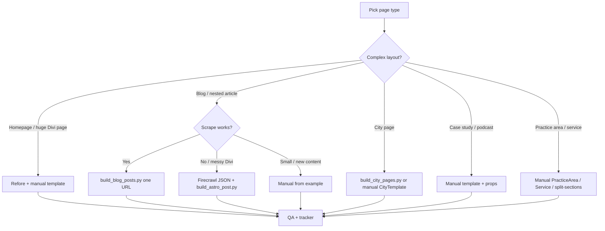

# Individual page migration

Step-by-step process for moving **one** URL from WordPress/Divi on goconstellation.com into this Astro repo. Use this when you have a single row on the migration tracker, a new post to port, or a page that failed bulk scraping.

**Related:** [MIGRATION-TOOLING.md](./MIGRATION-TOOLING.md) (script reference) · [MIGRATION-TRACKER.md](./MIGRATION-TRACKER.md) (sheet tabs) · [CONTENT-GUIDE.md](./CONTENT-GUIDE.md) (authoring after migration) · [ROUTING-REFERENCE.md](./ROUTING-REFERENCE.md) (paths & canonicals) · [REDIRECTS-AND-URLS.md](./REDIRECTS-AND-URLS.md) (redirect backlog) · [TEMPLATES.md](./TEMPLATES.md) (layout props) · [QA-PROCEDURES.md](./QA-PROCEDURES.md) (sign-off)

---

## What “migrate one page” means

You are **not** editing WordPress. You are:

1. Creating (or updating) a file under `src/pages/`
2. Wrapping content in the correct Astro **template**
3. Setting **`canonicalUrl`** to the production URL you want indexed
4. Verifying on **localhost** and **staging** after merge to `main`
5. Recording status on the [migration tracker](https://docs.google.com/spreadsheets/d/13jFsEzuXJp5MbTvwvQ1JmuTFIeLlGJ3zLXCSAUlMf4A/edit)

Nothing in `scripts/` runs during `npm run build` or deploy—migration is a **one-time offline** step, then normal Git workflow.

---

## Before you start

### 1. Find the URL on the tracker

Open the tab that matches the page type (Blog Posts, City, Case Studies, etc.). Note:

- **Production URL** (what WordPress serves today)
- **Template** (Blog, City, Case Study, …)
- **Status** (Done / Remaining / In review)

> **“Done” on the sheet may mean QA sign-off**, not merely “file exists.” Check `src/pages/` before rebuilding.

### 2. Check if the page already exists

```bash
# By slug fragment
find src/pages -name '*my-slug*'

# By production path in canonicals
grep -r 'canonicalUrl="https://goconstellation.com/my-path' src/pages/
```

If a file exists, you are doing a **refresh or QA pass**, not a greenfield migration. Do not re-run `build_blog_posts.py` on hand-edited files without a backup—it **overwrites**.

### 3. Work on a branch

```bash
git checkout -b migrate/my-page-slug
```

Commit before running bulk scripts so you can revert.

### 4. Fix script paths (if using Python tools)

`scripts/build_blog_posts.py` and `scripts/build_city_pages.py` may still contain another developer’s absolute paths (`/Users/patrickcarver/...`). Update `BLOG_DIR`, `PAGES_DIR`, and `IMAGES_DIR` to your repo root before running.

---

## The three URLs to decide up front

Every page has three related URLs. Align them **before** you write files.

| Concept | Question to answer | Example |
|---------|-------------------|---------|
| **Production URL** | What does WordPress rank today? | `https://goconstellation.com/law-firm-seo/` |
| **Astro file path** | Where will the `.astro` file live? | `src/pages/blog/law-firm-seo.astro` → `/blog/law-firm-seo/` |
| **Canonical** | What should Google index? | Usually **production URL** until you intentionally change SEO |

If Astro path ≠ production path, plan a **301 redirect** at launch ([REDIRECTS-AND-URLS.md](./REDIRECTS-AND-URLS.md)). Setting `canonicalUrl` alone is not enough if both URLs return 200.

---

## Choose your migration method



| Page type | Preferred method | Output path | Template |
|-----------|------------------|-------------|----------|
| Blog post | `build_blog_posts.py` or manual | `src/pages/blog/<slug>.astro` | `BlogPostTemplate` |
| Nested guide | `NESTED_POSTS` in same script or manual | `src/pages/law-firm-seo/<slug>.astro` etc. | `BlogPostTemplate` |
| City / location | `build_city_pages.py` or manual | `src/pages/attorney-marketing-<city>.astro` | `CityTemplate` |
| Case study | Manual | `src/pages/case-study/<slug>.astro` | `CaseStudyNarrativeTemplate` |
| Podcast | Manual | `src/pages/podcasts/<slug>.astro` | `PodcastTemplate` |
| Practice area | Manual (copy similar page) | `src/pages/<practice>-marketing.astro` | `PracticeAreaTemplate` |
| Service page | Manual or `split-sections.mjs` | `src/pages/<service>.astro` | `ServiceTemplate` or custom |
| Homepage | [REFORE-APPROACH.md](../REFORE-APPROACH.md) | `index.astro` + `HomepageTemplate` | `HomepageTemplate` |
| Core (about, FAQ) | Manual | `src/pages/<slug>.astro` | `CoreTemplate` |
| Agency review | Manual | `src/pages/blog/<slug>.astro` | `AgencyReviewTemplate` |

Deep script docs: [MIGRATION-TOOLING.md](./MIGRATION-TOOLING.md).

---

## Standard workflow (all page types)

Use this checklist for every single URL.

### Phase 1 — Plan

- [ ] Production URL confirmed (open in browser on live WordPress)
- [ ] Template chosen ([TEMPLATES.md](./TEMPLATES.md) picker)
- [ ] Target file path chosen ([ROUTING-REFERENCE.md](./ROUTING-REFERENCE.md))
- [ ] Canonical URL decided (usually production URL)
- [ ] Redirect needed? (file path ≠ canonical) — note in [REDIRECTS-AND-URLS.md](./REDIRECTS-AND-URLS.md)
- [ ] Nav/footer links updated if this is a new top-level page ([NAVIGATION.md](./NAVIGATION.md))

### Phase 2 — Build

- [ ] File created under `src/pages/`
- [ ] Template import path correct (`../../` depth from folder)
- [ ] `seoTitle`, `seoDescription`, `canonicalUrl` set
- [ ] Body content or template props filled
- [ ] Images in `public/images/` (not only `wp-content` hotlinks when avoidable)

### Phase 3 — Local verify

```bash
npm run dev
# Open http://localhost:4321/<astro-path>/
npm run build
```

- [ ] Page renders without Astro build errors
- [ ] Title and meta description look correct (view source)
- [ ] Canonical tag matches plan
- [ ] Header/footer links work
- [ ] Images load
- [ ] Embeds work (YouTube, forms) if applicable
- [ ] No obvious Divi junk (empty lists, broken iframes)

### Phase 4 — Staging verify

Merge PR → `main` → Cloudflare deploys `con-staging`.

- [ ] Open page on staging URL (basic auth if enabled)
- [ ] Compare side-by-side with production WordPress (layout, copy, CTAs)
- [ ] Mobile spot-check
- [ ] Internal links from this page resolve on staging

### Phase 5 — Close out

- [ ] Mark row **Done** (or **In review** / **QA**) on migration tracker
- [ ] Add redirect rule to `astro.config.mjs` if path mismatch (both slash variants)
- [ ] Update [TODO.md](./TODO.md) if this was a launch blocker
- [ ] PR merged; note any follow-ups in PR description

---

## Method A — Blog post via `build_blog_posts.py`

**Best for:** Standard Divi blog articles still on production.

### Steps

1. Open `scripts/build_blog_posts.py`.
2. Update `BLOG_DIR` to your repo’s `src/pages/blog`.
3. Add **one** tuple to `MISSING_POSTS`:

   ```python
   ('my-slug', 'https://goconstellation.com/my-slug/'),
   ```

   For nested paths (e.g. `/law-firm-seo/benefit/`), use `NESTED_POSTS`:

   ```python
   ('law-firm-seo/benefit', 'https://goconstellation.com/law-firm-seo/benefit/'),
   ```

4. Run:

   ```bash
   python3 scripts/build_blog_posts.py
   ```

5. Open `src/pages/blog/my-slug.astro` (or nested path).

### What the script does

```
Production URL
  → fetch HTML
  → extract title, description, publish date
  → extract Divi post body (.et_pb_post_content)
  → clean scripts, shortcodes, iframes
  → build chapter TOC from H2s (max 12)
  → wrap in BlogPostTemplate
```

### After the script

| Issue | Action |
|-------|--------|
| Placeholder body (“Content migrated from production…”) | Fetch failed—paste content manually or fix URL |
| `canonicalUrl` at root, file under `/blog/` | Add redirect or move file—see [REDIRECTS-AND-URLS.md](./REDIRECTS-AND-URLS.md) |
| `&#8217;`, `data-start` on `<p>` | Clean per [CONTENT-GUIDE.md](./CONTENT-GUIDE.md#editing-existing-migrated-content) |
| Images still on `wp-content/uploads` | Download to `public/images/` and update `src` |
| Broken TOC anchors | Fix `chapters` array or add `id` on `<h2>` |

---

## Method B — Blog post via Firecrawl + `build_astro_post.py`

**Best for:** Divi layout the bulk scraper mangled; you already have a JSON export.

### Steps

1. Scrape production with Firecrawl (or similar) to a JSON file on disk.
2. Run:

   ```bash
   python3 scripts/build_astro_post.py \
     /path/to/scrape-output.json \
     src/pages/blog \
     my-slug
   ```

3. Review output—this path **strips `` tags** and inline styles (cleaner HTML, images need re-adding).

Output: `src/pages/blog/my-slug.astro` with `pageTitle`, `readTime`, and cleaned body.

---

## Method C — Manual blog / article

**Best for:** New content, heavy edits, or posts where scripts are overkill.

1. Copy `src/pages/examples/blog-post-example.astro` or a similar live post.
2. Set props and HTML in the slot ([CONTENT-GUIDE.md](./CONTENT-GUIDE.md#adding-a-new-blog-post-manual)).
3. Match `chapters` `anchor` values to `<h2 id="...">`.

---

## Method D — City page via `build_city_pages.py`

**Best for:** Location landing pages (`attorney-marketing-*`, `law-firm-marketing-*`).

### Steps

1. Update `PAGES_DIR` and `IMAGES_DIR` in `scripts/build_city_pages.py`.
2. Add or confirm row in the `CITIES` list: `(slug, city_name, state, production_url)`.
3. Run (skips if `.astro` already exists):

   ```bash
   pip install Pillow   # if needed
   python3 scripts/build_city_pages.py --test   # smoke: first 3 cities
   python3 scripts/build_city_pages.py          # full list
   ```

4. Check `public/images/` for WebP heroes and `src/pages/{slug}.astro`.

### Manual alternative

Create `src/pages/attorney-marketing-austin.astro` with `CityTemplate` props only—no long HTML slot ([CONTENT-GUIDE.md](./CONTENT-GUIDE.md#adding-a-city-landing-page)).

---

## Method E — Case study (manual)

**No script**—structured template + narrative slots.

1. Create `src/pages/case-study/<short-slug>.astro`.
2. Use `CaseStudyNarrativeTemplate` with `clientName`, `keyResult`, `beforePoints`, `afterPoints`, etc.
3. Set `canonicalUrl`—often still the **old WordPress slug** at root (e.g. `/kairos-law-group-40xroi-case-study/`). Plan a 301 to `/case-study/kairos-law-group/` at launch.
4. Add entry to `src/pages/case-studies.astro` grid if it should appear on `/case-studies/`.
5. Put hero image in `public/images/case-study/`.

---

## Method F — Podcast episode (manual)

1. Create `src/pages/podcasts/<slug>.astro`.
2. Use `PodcastTemplate` with `embedUrl`, platform links, `duration`, `publishDate`.
3. Show notes in the default slot.
4. Check production: canonical may be root URL while file is under `/podcasts/`—same redirect pattern as blogs.

---

## Method G — Practice area & service pages (manual)

**Practice area:** Copy `src/pages/immigration-law-firm-marketing.astro` or `/examples/practice-area-example/`. Fill `chapters`, `caseStudies` cards, slot HTML.

**Service (large Divi):**

1. `node scripts/split-sections.mjs https://www.goconstellation.com/target-page/ ./sections-output`
2. Map each `section-NN.html` into `ServiceTemplate` or custom `BaseLayout` markup.
3. For flagship pages (homepage, `law-firm-seo-services`, `book-call`), see [REFORE-APPROACH.md](../REFORE-APPROACH.md) and [MIGRATION-TOOLING.md](./MIGRATION-TOOLING.md#refore-workflow-no-script-in-scripts).

---

## Method H — Homepage (Refore + Backstop)

Not a typical “one page” task—documented separately:

1. [REFORE-APPROACH.md](../REFORE-APPROACH.md) — export, CSS, HTML structure
2. [VISUAL-QA.md](./VISUAL-QA.md) — section screenshots vs production
3. Optional: `scripts/fix-loop.mjs` for automated CSS tweaks (review diffs carefully)

---

## SEO and routing checklist (per page)

| Check | Done? |
|-------|-------|
| `canonicalUrl` is full absolute production URL | |
| Trailing slash matches site convention (`/path/`) | |
| `seoTitle` / `seoDescription` present | |
| File path documented if ≠ canonical | |
| Redirect pair added to `astro.config.mjs` if needed (with and without `/`) | |
| No duplicate H1 in body (template provides title) | |
| `/examples/` not used for production content | |

Details: [SEO.md](./SEO.md) · [ROUTING-REFERENCE.md](./ROUTING-REFERENCE.md).

---

## Content cleanup (scraped pages)

After any automated scrape, expect WordPress artifacts:

| Artifact | Fix |
|----------|-----|
| HTML entities (`&#8217;`) | Replace with real quotes or leave |
| `data-start` / `data-color` on `<p>` | Remove |
| Empty `<ol></ol>` | Delete |
| Broken `mhtml.blink` iframes | Replace YouTube embed or remove |
| `class="wp-image-…"` | Optional cleanup |
| Absolute `https://goconstellation.com/...` links | Prefer `/path/` relative links |
| Hotlinked `wp-content/uploads` images | Copy to `public/images/` |

Do **not** bulk find-replace across all posts without review.

---

## Images

| Source | Where to put files | In HTML |
|--------|-------------------|---------|
| Migrated WP media | `public/images/wp-uploads/...` | `/images/wp-uploads/...` |
| City heroes | `public/images/attorney-marketing-{city}-title.webp` | `heroImage` prop |
| Case study | `public/images/case-study/` | `heroImage` prop |
| New assets | `public/images/` | `/images/filename.webp` |

Prefer WebP for photos. Always set `alt` text.

---

## When to update navigation

Update `SiteHeader.astro` / `SiteFooter.astro` only when the page is a **new** destination users should reach from the menu—not for every blog post.

| Page type | Usually in nav? |
|-----------|-----------------|
| Blog post | No (listed on `/blog/`) |
| Case study | No (listed on `/case-studies/`) |
| New practice area | Yes — Practice Areas dropdown |
| New flagship service | Yes — Services dropdown |
| City page | No (SEO landing) |

See [NAVIGATION.md](./NAVIGATION.md).

---

## Publishing path

```
Edit .astro (+ images) on branch
    → PR review
    → merge to main
    → GitHub Actions: npm run build → Wrangler → Cloudflare Pages (con-staging)
    → verify on staging.goconstellation.com
    → tracker row updated
```

Production **goconstellation.com** stays on WordPress until DNS cutover ([LAUNCH-CHECKLIST.md](./LAUNCH-CHECKLIST.md)).

---

## Common mistakes

| Mistake | Consequence |
|---------|-------------|
| Re-run blog scraper on edited file | Loses manual fixes |
| Set canonical only, no redirect | Two URLs indexed; split signals |
| File at `/blog/foo/` but footer links to `/foo/` | 404 on staging |
| Forget `case-studies.astro` grid entry | Case study not discoverable |
| Leave placeholder scrape body | Thin content on staging |
| Commit Refore CDN URLs without downloading | Broken images when CDN expires |
| Mark tracker Done before staging QA | Sheet overstates progress |

---

## Quick reference — one page, one command

| Goal | Command / action |
|------|------------------|
| Migrate one blog post (scrape) | Add to `MISSING_POSTS` → `python3 scripts/build_blog_posts.py` |
| Migrate one post (Firecrawl) | `python3 scripts/build_astro_post.py scrape.json src/pages/blog slug` |
| Migrate one city | Add to `CITIES` → `python3 scripts/build_city_pages.py` |
| Split a huge Divi page | `node scripts/split-sections.mjs <url> ./sections-output` |
| Preview locally | `npm run dev` → open path |
| Find existing file | `find src/pages -name '*slug*'` |
| Check canonical | `grep -r 'canonicalUrl.*slug' src/pages/` |

---

## Related documentation

| Document | Use for |
|----------|---------|
| [MIGRATION-TOOLING.md](./MIGRATION-TOOLING.md) | Full script API, troubleshooting, bulk order |
| [MIGRATION-TRACKER.md](./MIGRATION-TRACKER.md) | Sheet tabs, category totals |
| [CONTENT-GUIDE.md](./CONTENT-GUIDE.md) | Manual authoring per type |
| [TEMPLATES.md](./TEMPLATES.md) | Props, slots, examples |
| [ROUTING-REFERENCE.md](./ROUTING-REFERENCE.md) | URL taxonomy |
| [REDIRECTS-AND-URLS.md](./REDIRECTS-AND-URLS.md) | Redirect map |
| [QA-PROCEDURES.md](./QA-PROCEDURES.md) | Phase 4 sign-off |
| [VISUAL-QA.md](./VISUAL-QA.md) | Homepage visual diff |
| [REFORE-APPROACH.md](../REFORE-APPROACH.md) | Homepage / flagship export |
