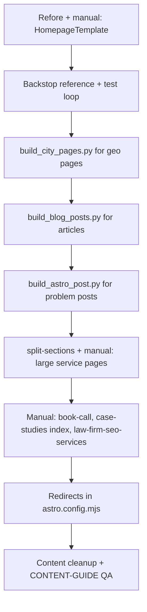

# Migration Tooling Guide

This guide documents every script and workflow used to move **goconstellation.com** from WordPress/Divi into this Astro repo. These tools are **offline generators**; nothing here runs during `npm run build` or deploy.

For manual content editing after migration, see [CONTENT-GUIDE.md](./CONTENT-GUIDE.md). For homepage export via Refore (no script in `scripts/`), see [REFORE-APPROACH.md](../REFORE-APPROACH.md). For visual regression, see [VISUAL-QA.md](./VISUAL-QA.md).

---

## Why migration tooling exists

The production site has **hundreds of pages** built in WordPress with Divi. Rebuilding each page by hand would take months. The migration stack:

1. **Scrapes** production HTML (or Refore/Firecrawl exports)
2. **Extracts** article bodies, meta tags, and images
3. **Writes** `.astro` files that wrap content in shared templates
4. **Verifies** visual parity with BackstopJS (and optionally an AI fix loop)

After migration, day-to-day edits are normal Git changes, not re-running scrapers.

---

## Tool map

| Tool | Language | Primary use |
|------|----------|-------------|
| [build_blog_posts.py](#build_blog_postspy) | Python 3 | Bulk blog + nested articles from production URLs |
| [build_astro_post.py](#build_astro_postpy) | Python 3 | Single post from Firecrawl JSON export |
| [build_city_pages.py](#build_city_pagespy) | Python 3 | City landing pages + WebP images |
| [split-sections.mjs](#split-sectionsmjs) | Node | Split a page into HTML section files for inspection |
| [fix-loop.mjs](#fix-loopmjs) | Node | Backstop + Claude → patch homepage template |
| [REFORE-APPROACH.md](../REFORE-APPROACH.md) | (none) | Homepage / complex pages via Refore CDN export |
| [backstop.config.cjs](#backstopjs) | (none) | Section-by-section screenshot diff vs production |

---

## Before you run anything

### 1. Fix hardcoded paths

Several scripts were written on another machine and still contain paths like:

```
/Users/patrickcarver/repos/con-staging/...
```

Search each script for `patrickcarver` or absolute paths and update to **your** repo root, for example:

```python
BLOG_DIR = '/Users/you/con-staging/src/pages/blog'
PAGES_DIR  = '/Users/you/con-staging/src/pages/'
IMAGES_DIR = '/Users/you/con-staging/public/images/'
```

### 2. Branch and commit

Bulk scripts can create or skip dozens of files. Work on a branch. Commit before running so you can revert.

### 3. Know overwrite behavior

| Script | If file already exists |
|--------|-------------------------|
| `build_blog_posts.py` | Overwrites when you run `process_post` (no skip in main loop) |
| `build_city_pages.py` | **Skips** if `{slug}.astro` already exists |
| `build_astro_post.py` | Overwrites output file |
| `fix-loop.mjs` | Overwrites `HomepageTemplate.astro` each applied edit |

Hand-edited pages can be destroyed if you re-run blog scrapers blindly.

### 4. SSL verification

Python scrapers disable SSL certificate verification (`SSL_CTX.verify_mode = ssl.CERT_NONE`) to work around macOS cert issues. Only run against URLs you trust (production/staging).

### 5. Be polite to production

Scripts sleep between requests (`time.sleep(0.5)`). Do not remove throttling or parallelize aggressively against live WordPress.

---

## `build_blog_posts.py`

**Purpose:** Fetch missing posts from **production** and emit `BlogPostTemplate` `.astro` files.

**Location:** `scripts/build_blog_posts.py`

### What it processes

Two lists at the top of the file:

1. **`MISSING_POSTS`**: slug + production URL. Output: `src/pages/blog/{slug}.astro`
2. **`NESTED_POSTS`**: path like `law-firm-seo/benefit` + URL. Output: `src/pages/law-firm-seo/benefit.astro`

To migrate a new post, add a tuple to the appropriate list, fix `BLOG_DIR` / `pages_dir`, then run.

### Per-post pipeline

```
Production URL
    → fetch_html()
    → extract_meta()          (title, description)
    → extract_publish_date()  (JSON-LD or article:published_time)
    → extract_body_content()  (Divi .et_pb_post_content, article, etc.)
    → clean_html()            (strip scripts, iframes, shortcodes)
    → extract_h2_chapters()   (up to 12 TOC entries)
    → write_blog_astro()      (BlogPostTemplate wrapper)
```

On **404 or fetch error**, it still writes a file with placeholder copy:

```html
<p>Content migrated from production. Visit the live site for full content.</p>
```

Replace those manually.

### Output shape

```astro
---
import BlogPostTemplate from '../../layouts/templates/BlogPostTemplate.astro';
---

<BlogPostTemplate
  seoTitle="..."
  seoDescription="..."
  canonicalUrl="https://goconstellation.com/..."
  publishDate="2025-12-07"
  chapters={[ ... ]}
>

<!-- scraped HTML body -->

</BlogPostTemplate>
```

- **`canonicalUrl`** is set to the **production URL** from the list (not necessarily `/blog/...`).
- Import depth is computed from slug depth (`../` × segments).

### How to run

```bash
cd /path/to/con-staging
python3 scripts/build_blog_posts.py
```

Requires Python 3 standard library only (no Pillow).

### After running

1. Spot-check a few posts in `npm run dev`.
2. Clean WordPress artifacts (see [CONTENT-GUIDE.md](./CONTENT-GUIDE.md#editing-existing-migrated-content)).
3. Fix URL mismatches: file may live at `/blog/slug/` while canonical points to `/slug/`; add redirects in `astro.config.mjs` if needed.
4. Script prints staging URLs for a migration tracker at the end.

---

## `build_astro_post.py`

**Purpose:** Build **one** blog post from a **Firecrawl** (or similar) JSON export; richer extraction than the bulk scraper for difficult Divi layouts.

**Location:** `scripts/build_astro_post.py`

### Input format

JSON array with a text item containing parsed scrape metadata:

```json
[{ "type": "text", "text": "{\"html\": \"...\", \"metadata\": { \"title\": \"...\", ... }}" }]
```

The script reads `metadata` (title, description, dates) and `html` (full page).

### Differences from `build_blog_posts.py`

| Behavior | `build_blog_posts.py` | `build_astro_post.py` |
|----------|----------------------|------------------------|
| Input | Live URL | JSON file on disk |
| Images in body | Kept (if in HTML) | **Stripped** (`` removed) |
| Inline styles/classes | Mostly kept | Stripped for cleaner Astro HTML |
| `pageTitle`, `readTime` | Not set | Set automatically |
| Import path | Depth-based | Fixed `../../layouts/...` |

Use this when Firecrawl already fetched the page and bulk regex extraction failed.

### How to run

```bash
python3 scripts/build_astro_post.py \
  /path/to/scrape-output.json \
  src/pages/blog \
  my-post-slug
```

Creates: `src/pages/blog/my-post-slug.astro`

Adjust the output directory for nested paths, e.g. `src/pages/law-firm-seo` and slug `benefit`.

---

## `build_city_pages.py`

**Purpose:** Generate **city landing pages** (`CityTemplate`) and download/optimize hero and scenery images.

**Location:** `scripts/build_city_pages.py`

### Dependencies

```bash
pip install Pillow
```

### What it does per city

1. **Skip** if `src/pages/{slug}.astro` already exists
2. Fetch production HTML (or create **placeholder** on 404)
3. Extract SEO title and meta description
4. Find `background-image` URLs in CSS/HTML, filter out shared sitewide assets (`SHARED_PATHS`)
5. Download images → convert to **WebP** (max width 1600px, quality ~82)
6. Write `src/pages/{slug}.astro` with `CityTemplate` props

### City list

All cities are in the `CITIES` tuple list at the bottom of the script: `(slug, city_name, state, production_url)`.

Covers both naming patterns:

- `attorney-marketing-austin`
- `law-firm-marketing-chicago`

### Generated page shape

```astro
<CityTemplate
  seoTitle="..."
  seoDescription="..."
  canonicalUrl="https://goconstellation.com/attorney-marketing-austin/"
  city="Austin"
  state="Texas"
  heroImage="/images/attorney-marketing-austin-title.webp"
  heroSubtitle="Your Legal Marketing Partner for Dominating Local Search in Austin, Texas"
  landscapeImage="/images/austin-building.webp"
  serviceImages={[
    '/images/austin-dome.webp',
    ...
  ]}
/>
```

**Note:** `CityTemplate` currently **does not use** `serviceImages` in the layout; only `heroImage` and `landscapeImage` affect the live page. The prop is still generated for future use or manual follow-up.

### How to run

```bash
# Update IMAGES_DIR and PAGES_DIR first!

# All cities in CITIES list
python3 scripts/build_city_pages.py

# First 3 cities only (smoke test)
python3 scripts/build_city_pages.py --test

# Print what would happen without writing files
python3 scripts/build_city_pages.py --dry-run
```

### After running

1. Confirm images landed in `public/images/`.
2. Open a few cities locally; hero/landscape should match files on disk.
3. For 404 placeholders, replace copy/images when production pages go live.

---

## `split-sections.mjs`

**Purpose:** Download a URL and split it into numbered HTML files; useful when migrating a **large Divi page** section by section (homepage, service pages).

**Location:** `scripts/split-sections.mjs`

### Split strategies (in order)

1. Divi `et_pb_section` blocks
2. HTML `<section>` tags
3. Semantic `<div>` wrappers (section, hero, footer, etc.)
4. Fallback: split on large whitespace gaps

### How to run

```bash
node scripts/split-sections.mjs https://www.goconstellation.com/ ./sections-output
```

**Output:**

```
sections-output/
  section-01.html
  section-02.html
  ...
  manifest.txt
```

Existing folders in the repo (`sections-output/`, `sections-albuquerque/`, `sections-seo-services/`) are examples from past runs.

### Typical workflow

1. Split production (or staging) page into sections
2. Open each `section-NN.html` and map to Astro template markup
3. Add matching `data-section="..."` attributes on staging for Backstop alignment
4. Do **not** commit huge section folders unless the team wants them as reference

---

## `fix-loop.mjs`

**Purpose:** Automated **homepage** pixel-parity loop: Backstop finds diffs → Claude suggests a single edit → patch `HomepageTemplate.astro` → repeat.

**Location:** `scripts/fix-loop.mjs`

### Requirements

- `ANTHROPIC_API_KEY` in `.env` or environment
- Dev server running (`npm run dev`) so Backstop can hit `localhost:4321`
- Playwright (installed via BackstopJS)

### What it modifies

Only:

```
src/layouts/templates/HomepageTemplate.astro
```

### Loop behavior

| Setting | Value |
|---------|--------|
| Max iterations | 8 |
| Target mismatch | &lt; 0.5% |
| Claude model | `claude-opus-4-6` (API) |
| Edit style | One `OLD:` / `NEW:` string replace per iteration |

### How to run

```bash
# Terminal 1
npm run dev

# Terminal 2
node scripts/fix-loop.mjs
# or: ANTHROPIC_API_KEY=sk-... node scripts/fix-loop.mjs
```

Review every change in git diff; this is assistive, not trusted CI.

### When to use vs skip

- **Use:** Homepage migration grind, many small CSS/spacing fixes
- **Skip:** Blog posts, city pages, or any page not covered by `backstop.config.cjs`

---

## BackstopJS

**Purpose:** Compare **staging homepage sections** to **production** Divi sections via screenshots.

Full guide: **[VISUAL-QA.md](./VISUAL-QA.md)** (section mapping, `data-section` setup, reports, troubleshooting).

```bash
npm run dev   # terminal 1
npx backstop reference --config=backstop.config.cjs   # baselines from production
npx backstop test --config=backstop.config.cjs
open backstop_data/html_report/index.html
```

---

## Refore workflow (no script in `scripts/`)

For flagship pages (especially the **homepage**), the team uses [Refore](https://refore.ai) to export production HTML + CDN-hosted CSS/images instead of regex scraping.

Full steps: **[REFORE-APPROACH.md](../REFORE-APPROACH.md)**

Summary:

1. Export page at refore.ai → get share link
2. Fetch raw HTML (often via Firecrawl)
3. Copy Refore CSS `<link>` tags into Astro `<Fragment slot="head">`
4. Paste HTML structure into templates; strip `#wpadminbar`, tracking, etc.
5. Download CDN images to `public/images/` for permanence (CDN URLs expire)

`public/css/production-extracted.css` is the sitewide Divi stylesheet snapshot used on every page via `BaseLayout`.

---

## Recommended migration order

A practical sequence that matches how this repo was built:



1. **Homepage**: Refore + `HomepageTemplate`; verify with Backstop (optional `fix-loop.mjs`)
2. **City pages**: `build_city_pages.py` (or manual if city already exists)
3. **Blog bulk**: `build_blog_posts.py` for remaining URLs
4. **Hard posts**: `build_astro_post.py` from Firecrawl JSON
5. **Large custom pages**: `split-sections.mjs` + hand-build in `BaseLayout`
6. **Redirects**: `astro.config.mjs` for renamed slugs
7. **Editorial pass**: images, internal links, placeholders, indexes (`blog/index.astro`)

---

## Path and URL mismatches (common gotchas)

| Issue | Example | What to do |
|-------|---------|------------|
| File under `/blog/` but canonical at root | `blog/law-firm-seo.astro` → canonical `/law-firm-seo/` | Add redirect or move file; align with SEO plan |
| Podcast file under `/podcasts/` but canonical at root | `podcasts/evolve-or-die-...` | Same |
| Nested post path | `law-firm-seo/benefit.astro` | Import path uses extra `../` |
| Staging URL in script output | `staging.goconstellation.com/blog/...` | Tracker only; production canonical stays `goconstellation.com` |
| Scraped body still has absolute WP links | `href="https://goconstellation.com/..."` | Optional cleanup to `/path/` |

---

## Troubleshooting

### Script cannot fetch production

- Check VPN/firewall
- Verify URL in browser
- SSL: script already bypasses verification; if still failing, try curl manually

### Empty or tiny article body

- Divi structure changed; update regex in `extract_body_content()` or use `build_astro_post.py` + Firecrawl
- Try `split-sections.mjs` and inspect which div holds content

### `build_city_pages.py`: no images downloaded

- All URLs matched `SHARED_PATHS` filters
- Production page uses inline styles without `background-image` URLs
- Add images manually to `public/images/`

### Backstop: all sections fail

- Dev server not running on port 4321
- `/examples/homepage-example` missing `data-section` attributes
- Production homepage structure changed (Divi section indices shifted)

### `fix-loop.mjs`: OLD string not found

- Claude quoted stale template snippet
- Run again or apply fix manually

### Pillow install errors

```bash
pip3 install Pillow
# or python3 -m pip install Pillow
```

---

## What not to migrate with scripts

| Page type | Better approach |
|-----------|-----------------|
| Homepage | Refore + `HomepageTemplate` |
| `law-firm-seo-services`, `law-firm-ppc` | Manual / split-sections (very large) |
| `case-studies.astro` index | Manual grid |
| `book-call.astro` | Manual (booking iframe) |
| Practice area guides with custom components | Copy `PracticeAreaTemplate` example |

---

## Related documentation

| Document | Topics |
|----------|--------|
| [CONTENT-GUIDE.md](./CONTENT-GUIDE.md) | Manual edits after migration |
| [TEMPLATES.md](./TEMPLATES.md) | Which template each generator uses |
| [DEVELOPMENT.md](./DEVELOPMENT.md) | npm, local dev |
| [VISUAL-QA.md](./VISUAL-QA.md) | BackstopJS in depth |
| [REFORE-APPROACH.md](../REFORE-APPROACH.md) | Homepage Refore export |
