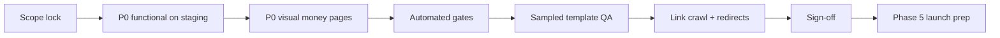
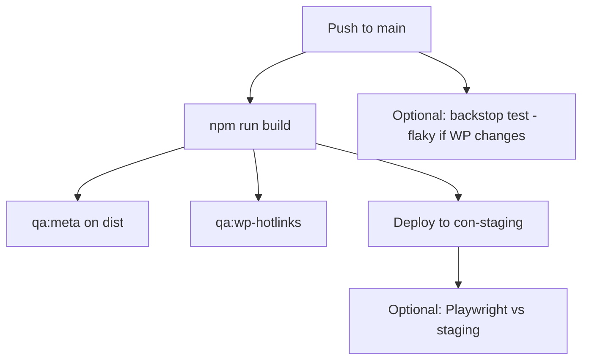

# QA Procedures

**Last updated:** 2026-05-18  
**Purpose:** Operational runbook for Phase 4 QA—how to run QA, in what order, who does what, how long it takes, and how to automate repeatable checks.

**Companion docs (scope vs procedure):**

| Document | Use for |
|----------|---------|
| [QA-BREAKDOWN.md](./QA-BREAKDOWN.md) | Full task list, priorities (P0/P1/P2), sign-off checklist |
| [VISUAL-QA.md](./VISUAL-QA.md) | BackstopJS commands and homepage section mapping |
| [PROGRESS-PERCENTAGE.md](./PROGRESS-PERCENTAGE.md) | Percent complete by category |
| [LAUNCH-CHECKLIST.md](./LAUNCH-CHECKLIST.md) | Cutover after Phase 4 sign-off |

---

## 1. What QA is on this project

**QA (Phase 4)** is the work between “pages exist in Git and `npm run build` passes” and “safe to point DNS at Astro.”

| QA verifies | QA does not include |
|-------------|---------------------|
| Staging matches production intent (visual, copy, assets) | Writing ~300 net-new pages (mostly done) |
| Conversion flows work on **staging.goconstellation.com** | DNS cutover (Phase 5) |
| Metadata, links, redirects, embeds | Full manual review of every blog/city URL |
| Sampled checks on high-volume templates | Pixel-perfect every page before launch |

**Exit criterion:** A named owner completes the [Phase 4 sign-off](#8-sign-off-procedure) on the **deployed staging host** (not only `localhost`) and records pass/fail plus known exceptions.

**Current estimate:** Phase 4 ~**25–35%** complete; holistic deployment readiness ~**55–60%** ([PROGRESS-PERCENTAGE.md](./PROGRESS-PERCENTAGE.md)).

---

## 2. Prerequisites (before starting QA)

Complete these once per QA cycle (or when scope changes):

1. **Scope lock** — Reconcile the [migration tracker](https://docs.google.com/spreadsheets/d/13jFsEzuXJp5MbTvwvQ1JmuTFIeLlGJ3zLXCSAUlMf4A/edit?usp=sharing) with repo URL counts. QA tests against the **official URL list**, not assumptions.
2. **Clean build** — `npm run build` passes on `main` locally and in GitHub Actions.
3. **Staging deploy** — Latest `main` on Cloudflare Pages project `con-staging` (staging.goconstellation.com).
4. **Credentials** — Staging basic auth (if enabled), GHL/ClickUp allowlists for staging hostname.
5. **Tracking sheet** — Copy the [QA tracking template](#7-tracking-and-reporting) (spreadsheet or GitHub Project).

**Environments:**

| Environment | Use for |
|-------------|---------|
| `npm run dev` | Fast fixes while editing |
| `npm run build && npm run preview` | Production-like HTML, link crawls, meta scripts |
| **staging.goconstellation.com** | Integrations (GHL, ClickUp), final sign-off |
| www.goconstellation.com | Visual reference (WordPress until cutover) |

---

## 3. QA workflow overview



Run **P0 before P1**. Run **automated gates** after each merge to `main` when possible—not only at the end.

---

## 4. Procedures by workstream

Each section lists: **goal**, **procedure**, **time estimate**, **automation**.

### 4.1 Visual & layout parity

**Goal:** High-traffic pages look correct vs production; no broken layout on desktop and mobile.

**Procedure:**

1. Fix **blocker for automation:** add `data-section` attributes on `HomepageTemplate.astro` per [VISUAL-QA.md](./VISUAL-QA.md).
2. **Homepage (P0)** — Run Backstop or manual side-by-side:
   ```bash
   # Terminal 1
   npm run dev
   # Terminal 2
   npx backstop test --config=backstop.config.cjs
   open backstop_data/html_report/index.html
   ```
   Accept ≤1% mismatch per section, or document exceptions.
3. **Money pages (P0)** — Manual pass at 375px, 768px, 1440px:
   - `/book-call/`, `/law-firm-seo-services/`, `/law-firm-ppc/`, `/law-firm-web-design/`
4. **Template samples (P1)** — One page each: city, practice area, `ServiceTemplate`, blog, podcast, case study, `CoreTemplate` (use `/examples/*` for chrome, then one production URL).
5. **Per-page checklist** (copy into tracking sheet):
   - Hero image and H1 readable
   - Nav dropdowns + mobile menu
   - Footer alignment and social icons
   - No horizontal scroll
   - Poppins headings (not system serif fallback)

**Time:** Homepage 4–8 hrs · Each flagship service 1–2 hrs · Template sample pack 6–10 hrs · Sitewide P2 polish 1–2 weeks (optional pre-launch)

**Automation:** Backstop (homepage, desktop 1440px). See [§6 Automation roadmap](#6-automation-roadmap).

---

### 4.2 Functional & integration QA

**Goal:** Leads can book a call and submit support tickets on the **staging domain**.

**Procedure:**

1. Open staging in a normal browser (not only DevTools device mode for embeds).
2. **`/book-call/` (P0)** — LeadConnector iframe loads; scroll/height OK on mobile; complete a test booking if GHL allows test mode.
3. **`/support-center/` (P0)** — ClickUp form loads and submits.
4. **`/thank-you/` (P0)** — Page loads; confirm GHL redirect URL in GoHighLevel settings matches Astro path.
5. **Header CTA (P0)** — “Book a Call” → `/book-call/`.
6. **Podcasts (P1)** — Sample 3 episodes; fix `embedUrl=""` on `podcasts/how-to-close-more-cases.astro`.
7. **Regression** — Re-run after any Cloudflare, GHL domain, or `book-call.astro` change.

**Time:** First pass 2–3 hrs · Re-test after integration changes 30–60 min

**Automation:** Playwright smoke tests against staging URL (recommended—see §6.3). No E2E suite in repo today.

Details: [INTEGRATIONS.md](./INTEGRATIONS.md)

---

### 4.3 Content & asset parity

**Goal:** No silent copy/image regressions; P0 pages do not depend on live WordPress CDN.

**Procedure:**

1. **WP hotlink audit (P0)** — Run on every QA cycle:
   ```bash
   grep -r "wp-content/uploads" src/ --include="*.astro" -l
   ```
   Migrate P0 assets to `public/images/` (book-call testimonials, `CityTemplate` cards, homepage badges).
2. **Service manifest (P0)** — Compare tracker service URLs vs built pages (~9 of ~18 in repo today).
3. **Sampling (P1)** — Do not open all ~386 pages:
   | Bucket | Sample | Method |
   |--------|--------|--------|
   | Cities | 8–10 | Top traffic + random |
   | Blogs | 15–25 | GSC top URLs + random |
   | Case studies | 10 or all 27 | Narrative + images |
   | Podcasts | All 23 or missing `embedUrl` | Frontmatter grep |
4. **Blog index** — Confirm new posts appear on `blog/index.astro` if they should be featured.

**Time:** Hotlink migration 1–2 days · Sampling 2–3 days · Service gap build 1–2 weeks (dev, parallel)

**Automation:** CI script fails build if new `wp-content` paths appear in `src/` (allowlist file optional). See §6.2.

---

### 4.4 SEO & metadata QA

**Goal:** Indexable pages have correct `<title>`, description, canonical; staging-only routes excluded.

**Procedure:**

1. **Fix known bug (P0)** — `CoreTemplate` passes `seoTitle` but `BaseLayout` expects `title` (about, FAQ, privacy, blog index, support-center).
2. **Top 20 URLs (P0)** — View-source on staging for title, description, canonical, one H1.
3. **`/examples/*` (P0)** — noindex, remove from build, or block before production (10 routes ship today).
4. **www vs non-www (P0)** — Align with DNS decision.
5. **OG spot-check (P2)** — Facebook Sharing Debugger on `/` and `/book-call/`.

**Minimum top-20 list:** `/`, `/book-call/`, `/law-firm-seo-services/`, `/law-firm-ppc/`, `/law-firm-web-design/`, `/case-studies/`, `/about-us/`, `/blog/`, `/services/`, `/support-center/`, plus priority practice areas and 5–8 blog/city URLs.

**Time:** Dev fix 1–2 hrs · Top-20 audit 2–3 hrs

**Automation:** Script over `dist/` HTML for missing/duplicate titles (§6.2). Manual view-source still required for canonical correctness.

Details: [SEO.md](./SEO.md)

---

### 4.5 Navigation, links & redirects

**Goal:** No 404s from nav; legacy WordPress URLs redirect.

**Procedure:**

1. **Manual nav (P0)** — Click every header dropdown and footer link on staging; log failures in tracking sheet.
2. **Footer sitemap (P1)** — Today points at WordPress `sitemap_index.xml`; plan Astro sitemap or redirect.
3. **Redirect map (P0)** — Export manifest old→new URLs; implement in `astro.config.mjs` and/or Cloudflare bulk rules (only 3 redirects in config today).
4. **Crawl (P1)** — After `npm run build && npm run preview`:
   ```bash
   npx linkinator http://localhost:4321 --recurse --skip '.*\\.(png|jpg|jpeg|gif|webp|woff2?|css|js)$'
   ```
   Export 404 list; triage blockers vs acceptable (external, legacy).

**Time:** Manual nav 1–2 hrs · Redirect implementation 2–5 days · Crawl + triage 4–8 hrs

**Automation:** Linkinator in CI on preview (§6.3). Screaming Frog optional for full export.

---

### 4.6 Performance spot-check

**Goal:** Money pages load acceptably; no surprise from ~488KB Divi CSS.

**Procedure:**

1. Lighthouse (Chrome DevTools) on `/`, `/book-call/`, one blog post.
2. Record LCP, CLS, total blocking time; file tickets only if unusable or regressed vs production.
3. PurgeCSS / CSS diet is **post-launch OK** unless scores block business sign-off.

**Time:** 1–2 hrs first pass

**Automation:** Lighthouse CI optional (§6.4)—not a hard gate initially.

---

### 4.7 Accessibility spot-check

**Goal:** No obvious blockers on conversion paths; legal pages linked.

**Procedure:**

1. Keyboard: open mobile menu, tab through header, reach book-call CTA.
2. Iframes: `title` on booking and ClickUp embeds.
3. Footer: `privacy-policy`, `terms-of-service` present and load.

**Time:** 2–3 hrs (not full WCAG audit)

**Automation:** axe-core in Playwright for P0 URLs (optional, §6.3).

---

## 5. Timeline

**Assumption:** 1 FTE developer + part-time QA (~20 hrs/week). Add parallel QA capacity to shorten calendar time.

### 5.1 Phase calendar (realistic: 5–7 weeks to Phase 4 sign-off)

| Week | Focus | Deliverables |
|------|--------|--------------|
| **1** | Scope lock + P0 functional | Tracker reconciled; book-call, support, thank-you pass on staging; hotlink list |
| **2** | P0 visual + dev blockers | Homepage acceptable; `data-section`; CoreTemplate title; examples noindex plan |
| **3** | Money pages + automation v1 | Backstop in routine; linkinator on preview; flagship services QA |
| **4** | Sampled content QA | 8–10 cities, 15–25 blogs, podcasts, case studies; redirect map draft |
| **5** | Crawl + redirects + meta | Top-20 meta pass; link crawl triaged; Cloudflare redirect rules staged |
| **6** | Sign-off + exception log | Phase 4 sign-off on staging; tickets for fast-follow |
| **7** (buffer) | Fixes from sign-off | Re-test P0 only |

**Parallel track (dev):** Missing ~9 service pages (1–2 weeks) can overlap weeks 2–4—does not block functional QA on existing URLs.

### 5.2 Scenario summary

| Scenario | Phase 4 QA duration | Team |
|----------|---------------------|------|
| **Aggressive** | 2–3 weeks | 2 devs + dedicated QA week 2–3 |
| **Realistic** | 4–5 weeks (within 5–7 week launch plan) | 1 dev + part-time QA |
| **Conservative** | 6–8 weeks | Part-time dev; full homepage + all-service visual parity |

**Critical path:** Staging functional QA (book-call, support) → P0 visual (homepage + book-call) → redirect/crawl → sign-off.

Blog/city volume is **not** on the critical path if sampling passes and redirects cover URL changes.

### 5.3 Effort by workstream (person-hours)

| Workstream | P0 only | P0 + P1 | Notes |
|------------|--------:|--------:|-------|
| Visual | 16–24 | 40–60 | Homepage dominates |
| Functional | 4–6 | 8–12 | Staging hostname required |
| Content/assets | 8–16 | 24–40 | Hotlinks + sampling |
| SEO/metadata | 4–8 | 8–12 | Top 20 + template fix |
| Nav/links/redirects | 8–16 | 24–40 | Redirect map is largest variable |
| Performance | — | 4–6 | Spot-check |
| Accessibility | — | 4–6 | Spot-check |
| **Total** | **~40–70** | **~110–170** | Excludes service page builds |

---

## 6. Automation roadmap

Automation does not replace judgment on brand and content—it **reduces regression** and **speeds each merge cycle**.

### 6.1 Already in repo

| Tool | What it automates | Limitation |
|------|-------------------|------------|
| `npm run build` (CI) | Compile ~400 static routes | No content/visual correctness |
| BackstopJS | Homepage section screenshots vs production | Localhost only; desktop 1440px; needs `data-section` |
| `grep wp-content` | Find WordPress CDN dependencies | Manual interpretation |
| `scripts/fix-loop.mjs` | AI-assisted homepage CSS tweaks | Optional; needs API key; review all diffs |

### 6.2 Quick wins (add to repo—recommended)

Implement as `package.json` scripts and optional CI steps:

| Script | Command / approach | Catches |
|--------|-------------------|---------|
| `qa:wp-hotlinks` | `grep -r "wp-content/uploads" src/ --include="*.astro"` exit 1 if matches allowlist | New WP dependencies |
| `qa:build` | `npm run build` | Broken pages |
| `qa:meta` | Node script: parse `dist/**/*.html`, flag missing `<title>`, duplicate titles, empty `description` | SEO regressions |
| `qa:examples` | Assert `/examples/` pages have `noindex` or are excluded from sitemap | Accidental indexing |
| `backstop:test` | `backstop test --config=backstop.config.cjs` | Homepage visual drift |

**Suggested `package.json` additions (for implementers):**

```json
{
  "scripts": {
    "qa:build": "npm run build",
    "qa:wp-hotlinks": "node scripts/qa/wp-hotlinks.mjs",
    "qa:meta": "node scripts/qa/check-meta.mjs",
    "qa:links": "npm run build && npm run preview & sleep 3 && npx linkinator http://localhost:4321 --recurse",
    "backstop:reference": "backstop reference --config=backstop.config.cjs",
    "backstop:test": "backstop test --config=backstop.config.cjs"
  }
}
```

Run `qa:wp-hotlinks` and `qa:meta` in GitHub Actions after `npm run build` (fail on new violations; grandfather existing hotlinks via allowlist until migrated).

### 6.3 Medium-term (2–4 weeks engineering)

| Automation | Approach | Value |
|------------|----------|-------|
| **Playwright smoke** | 3–5 tests: homepage loads, book-call iframe visible, support-center iframe, header CTA href | Catch integration breaks per deploy |
| **Staging Backstop** | Point test URL at stable Cloudflare deployment URL | QA matches what marketing reviews |
| **Template spot Backstop** | 1 scenario each for `/examples/city-example/`, `service-example/`, etc. | Template-level regression |
| **Redirect tests** | Playwright or `curl -I` list from manifest CSV | 301 coverage |
| **axe on P0** | `@axe-core/playwright` on `/`, `/book-call/`, `/support-center/` | Obvious a11y regressions |

**Playwright against staging** (pseudocode):

```js
// tests/smoke/book-call.spec.ts — run in CI with secrets for basic auth
test('booking iframe loads', async ({ page }) => {
  await page.goto('https://staging.goconstellation.com/book-call/');
  await expect(page.locator('iframe[title*="calendar"], iframe[src*="leadconnector"]')).toBeVisible();
});
```

### 6.4 Longer-term / post-launch

| Automation | Notes |
|------------|-------|
| Lighthouse CI | Budget on `/` and `/book-call/`; warn-only first |
| Full-site Backstop | High maintenance; prefer template samples |
| Visual Percy/Chromatic | Paid; good for component library—not needed for static Astro pages initially |
| Screaming Frog scheduled | Weekly crawl of production post-cutover |
| GSC / 404 monitoring | Post-launch operational QA |

### 6.5 CI workflow (recommended shape)



- **Always gate:** `build`, `qa:wp-hotlinks` (with allowlist), `qa:meta` on top N paths.
- **Optional / nightly:** Backstop (production homepage changes cause false failures).
- **Post-deploy:** Playwright smoke on staging (manual trigger or workflow_dispatch).

### 6.6 What not to automate (yet)

- Full copy parity for 160 blog posts
- Subjective brand spacing across all templates
- GHL calendar booking in CI (use manual staging test + test mode)
- Pixel-perfect mobile for every city page

Use **sampling + redirects** instead.

---

## 7. Tracking and reporting

### 7.1 QA tracking sheet columns

| Column | Example |
|--------|---------|
| URL | `/book-call/` |
| Priority | P0 |
| Workstream | Functional |
| Owner | @name |
| Status | Pass / Fail / Blocked |
| Environment | staging / preview |
| Notes | iframe height on iOS |
| Ticket | LINK-123 |

### 7.2 Weekly QA report (template)

1. **Staging commit tested:** `abc1234`
2. **P0 status:** X/Y passed
3. **New failures this week:** (bullets)
4. **Automation:** build ✅ · meta ⚠️ · backstop ❌ (hero 18%)
5. **Blockers for sign-off:** (list)
6. **Next week:** (top 3 tasks)

### 7.3 Defect severity

| Severity | Definition | Blocks sign-off? |
|----------|------------|------------------|
| **S1** | Cannot book call, support broken, major 404 on nav, wrong legal page | Yes |
| **S2** | Wrong title on P0 page, broken hero image on money page, redirect missing for top URL | Yes |
| **S3** | Visual drift on sampled blog, minor spacing, non-P0 broken image | No—document |
| **S4** | Typos, P2 polish, PurgeCSS | No |

---

## 8. Sign-off procedure

1. Confirm [QA-BREAKDOWN.md § Phase 4 sign-off checklist](./QA-BREAKDOWN.md#phase-4-sign-off-checklist) on **staging.goconstellation.com**.
2. All **P0** items pass or have written exceptions (ticket + owner + target date).
3. **S1/S2** defects: zero open, or explicit business acceptance.
4. Record:

| Field | Value |
|-------|--------|
| Date | |
| Staging commit | |
| Signed off by | |
| Known exceptions | Link to tickets |

5. Schedule Phase 5 using [LAUNCH-CHECKLIST.md](./LAUNCH-CHECKLIST.md) (GTM, robots, sitemap, DNS).

**Sign-off does not mean launch**—only that Astro is ready for cutover prep.

---

## 9. Roles (RACI)

| Activity | Design / migration | Dev | Content | Marketing ops | QA lead |
|----------|:--:|:--:|:--:|:--:|:--:|
| Homepage visual | R/A | C | I | I | C |
| `data-section`, template bugs | C | R/A | I | I | C |
| Book-call / support flows | I | C | I | R/A | C |
| Blog/city sampling | C | I | R/A | I | C |
| Redirect map | I | R/A | C | I | C |
| Tracker reconcile | C | C | R/A | I | A |
| Sign-off | I | C | C | C | R/A |

*R = responsible, A = accountable, C = consulted, I = informed*

---

## 10. Daily / per-PR QA routine (streamlined)

For each merge to `main` that touches `src/pages`, `src/templates`, or `src/layouts`:

1. `npm run build` (or wait for CI).
2. If homepage/templates: `npx backstop test` (local).
3. If integrations: smoke-test `/book-call/` and `/support-center/` on staging after deploy (~2 min).
4. If new images in content: `npm run qa:wp-hotlinks` (when script exists) or manual grep.
5. Log result in PR description: `QA: build ✅ · staging book-call ✅ · backstop hero ⚠️ 12%`

---

## 11. Related documentation

| Document | Topics |
|----------|--------|
| [QA-BREAKDOWN.md](./QA-BREAKDOWN.md) | Full task breakdown, P0/P1/P2, template cheat sheet |
| [VISUAL-QA.md](./VISUAL-QA.md) | Backstop setup, thresholds, troubleshooting |
| [PROGRESS-PERCENTAGE.md](./PROGRESS-PERCENTAGE.md) | Category percentages and launch timeline |
| [LAUNCH-CHECKLIST.md](./LAUNCH-CHECKLIST.md) | Post-QA cutover |
| [INTEGRATIONS.md](./INTEGRATIONS.md) | GHL, ClickUp, GTM |
| [SEO.md](./SEO.md) | Canonicals, robots, sitemap |
| [TEMPLATES.md](./TEMPLATES.md) | Template props and `/examples/` routes |
| [DEVELOPMENT.md](./DEVELOPMENT.md) | Local dev and preview |
