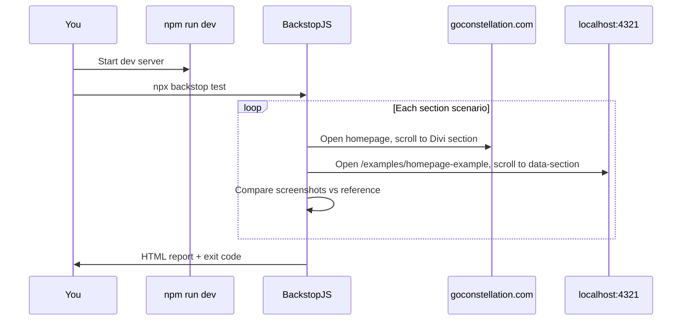

# Visual QA Guide

This guide explains **how to compare the Astro staging homepage to production** using BackstopJS: screenshot diffs, reports, and the optional AI fix loop.

For migration scripts overview, see [MIGRATION-TOOLING.md](./MIGRATION-TOOLING.md). For local dev setup, see [DEVELOPMENT.md](./DEVELOPMENT.md).

---

## What visual QA is for

During the WordPress → Astro migration, “does it look right?” is as important as “does it build?”. BackstopJS:

1. Opens **production** (`www.goconstellation.com`) and **local staging** (`localhost:4321`)
2. Scrolls to the **same homepage section** on each
3. Captures a **viewport screenshot**
4. Pixels-compares staging vs a saved **reference** image from production
5. Writes an **HTML report** with pass/fail and diff overlays

**Scope today:** Homepage only, via `/examples/homepage-example/` (uses `HomepageTemplate`). It does **not** test every blog post or city page automatically.

---

## Tooling in this repo

| Piece | Location |
|-------|----------|
| Backstop config | `backstop.config.cjs` |
| Scroll engine script | `backstop_data/engine_scripts/scroll_to_section.cjs` |
| Reference screenshots | `backstop_data/bitmaps_reference/` |
| Test run output | `backstop_data/bitmaps_test/<timestamp>/` |
| HTML report | `backstop_data/html_report/index.html` |
| CI-style report | `backstop_data/ci_report/xunit.xml` |
| AI fix loop (optional) | `scripts/fix-loop.mjs` |
| Dependency | `backstopjs` in `package.json` devDependencies |

Backstop uses **Playwright (Chromium)**. First run may download browser binaries.

---

## How a test run works



### URLs under test

| Role | URL |
|------|-----|
| **Reference (production)** | `https://www.goconstellation.com/` |
| **Test (staging)** | `http://localhost:4321/examples/homepage-example` |

Defined at the top of `backstop.config.cjs`.

### Section mapping

Each scenario compares one **vertical slice** of the homepage:

| Label (config) | Staging scroll target | Production scroll target |
|----------------|----------------------|-------------------------|
| Hero | `[data-section="hero"]` | `.et_pb_section_0` |
| Pain Points | `pain-points` | `.et_pb_section_1` |
| Agencies Talk | `agencies` | `.et_pb_section_2` |
| Growth System | `growth` | `.et_pb_section_3` |
| Comparison | `comparison` | `.et_pb_section_4` |
| Testimonials | `testimonials` | `.et_pb_section_5` |
| Services | `services` | `.et_pb_section_6` |
| Why Choose Us | `why-us` | `.et_pb_section_7` |
| Awards | `awards` | `.et_pb_section_8` |
| FAQ | `faq` | `.et_pb_section_9` |
| Guides | `guides` | `.et_pb_section_10` |

The engine script (`scroll_to_section.cjs`):

- On **production:** hides WP header, scrolls to the Divi section class
- On **staging:** hides `nav`/`header`, scrolls to `[data-section="..."]`
- Waits **800ms** after scroll (plus scenario **delay: 2500ms** before capture)

### Viewport

- **Desktop only:** 1440×900 (`backstop.config.cjs`)
- No mobile/tablet scenarios configured yet

### Pass/fail threshold

```js
misMatchThreshold: 1.0,  // percent
```

A scenario **passes** if pixel mismatch is **≤ 1%**. Typical failed runs in this repo show **15–25%+** on major sections until the homepage is closer to production.

---

## Prerequisites

1. **Node 22+** and `npm install` (includes `backstopjs`)
2. **Dev server running** before `test` or `reference`:

```bash
npm run dev
```

3. **Network** to load production homepage (reference captures)
4. **Reference images** exist in `backstop_data/bitmaps_reference/` (see [First-time setup](#first-time-setup))

### Important: `data-section` on staging

Backstop scrolls staging via **`data-section` attributes** on homepage sections. Those attributes must exist on the elements you want aligned at the top of the viewport.

**Check `HomepageTemplate.astro`**: if sections only have HTML comments like `SECTION 1: HERO` but no `data-section="hero"`, the scroll script will not find the target and screenshots may show the wrong part of the page.

**Fix:** Add attributes to match the config, for example:

```html
<section data-section="hero" style="...">
```

Repeat for each row in the section mapping table above.

---

## Commands

Run from **repo root**. Keep `npm run dev` running in another terminal.

### Capture production baselines (reference)

Run when:

- Setting up Backstop for the first time
- Production homepage design changed and you want new baselines

```bash
npx backstop reference --config=backstop.config.cjs
```

Writes PNGs to `backstop_data/bitmaps_reference/`.

### Compare staging to reference (test)

```bash
npx backstop test --config=backstop.config.cjs
```

- Creates `backstop_data/bitmaps_test/<timestamp>/` with test images and `report.json`
- Regenerates `backstop_data/html_report/`
- **Exit code non-zero** if any scenario fails (useful for scripts)

### Open the report

```bash
open backstop_data/html_report/index.html
```

Or open that file in a browser. You will see:

- Side-by-side reference vs test
- **Diff** image (pink/magenta = changed pixels)
- Mismatch percentage per scenario

### Approve staging as new reference (use carefully)

```bash
npx backstop approve --config=backstop.config.cjs
```

Copies **test** screenshots over **reference**. Only use when staging is intentionally the new source of truth, not when you are still chasing production parity.

---

## First-time setup

If `backstop_data/bitmaps_reference/` is empty or missing scenarios:

```bash
# Terminal 1
npm run dev

# Terminal 2
npx backstop reference --config=backstop.config.cjs
npx backstop test --config=backstop.config.cjs
open backstop_data/html_report/index.html
```

Confirm each scenario’s reference image actually shows the intended production section (not the wrong scroll position).

---

## Optional: AI fix loop (`fix-loop.mjs`)

Automates **one section at a time** on the worst mismatch:

1. Run Backstop `test`
2. Send reference, test, and diff images to **Claude** (`claude-opus-4-6`)
3. Claude returns `OLD:` / `NEW:` text to replace in `HomepageTemplate.astro`
4. Wait for dev server hot reload (~4s)
5. Repeat up to **8** iterations or until mismatch **&lt; 0.5%**

### Requirements

```bash
# .env at repo root (gitignored)
ANTHROPIC_API_KEY=sk-...
```

```bash
# Terminal 1
npm run dev

# Terminal 2
node scripts/fix-loop.mjs
```

### Caveats

- Edits only **`HomepageTemplate.astro`**: review every diff in git
- One string replace per iteration; may fail if `OLD:` block is not unique
- **0.5%** target is stricter than Backstop’s **1%** threshold
- Costs API usage; not for CI without consideration
- Does not replace human judgment on brand/layout decisions

---

## Aligning config with the real homepage

`HomepageTemplate.astro` has **14** commented sections (Hero, Stats, Accordion, Growth, Comparison, Testimonials, etc.). `backstop.config.cjs` defines **11** scenarios with different names (e.g. “Pain Points” vs “Does this sound familiar?”).

Older test reports may reference labels like **“Stats Bar”** that are not in the current config; sign the config and template have diverged over time.

**When sections do not line up:**

1. List actual sections in `HomepageTemplate.astro` in order
2. Inspect production with DevTools; note `.et_pb_section_N` indices
3. Update the `sections` array in `backstop.config.cjs` so labels, `data-section`, and `.et_pb_section_N` match
4. Re-run `npx backstop reference` after production mapping changes

---

## What to commit vs gitignore

| Path | Commit? |
|------|---------|
| `backstop.config.cjs` | Yes |
| `backstop_data/engine_scripts/` | Yes |
| `backstop_data/html_report/` (generated) | Usually no; regenerated each run |
| `backstop_data/bitmaps_test/` | Usually no; large, timestamped |
| `backstop_data/bitmaps_reference/` | **Team choice**: needed for others to run `test`; can be large. This repo may only ship a subset. |

If references are not committed, each developer must run `backstop reference` once (against live production).

---

## Manual visual QA (without Backstop)

Backstop does not cover everything. Also check manually:

| Area | Why manual |
|------|------------|
| Blog / city / case study pages | No scenarios configured |
| Mobile layouts | Only desktop 1440px in config |
| Hover states, dropdowns | Screenshots are static |
| Third-party embeds | Booking widget, podcast iframes |
| Fonts | Subtle differences may score under 1% but look wrong |
| Staging on Cloudflare | Backstop tests **local** dev, not deployed staging URL |

For deployed staging, spot-check `https://staging.goconstellation.com` (or your Pages URL) after merge to `main`.

---

## Troubleshooting

### `backstop test` cannot connect to localhost

- Start `npm run dev` first
- Confirm `http://localhost:4321/examples/homepage-example` loads in a browser

### All scenarios fail with huge mismatch

- Missing or wrong `data-section` on staging → fix `HomepageTemplate`
- Reference images captured at wrong scroll position → re-run `reference`
- Staging homepage structurally different from production → expected during migration

### Production scroll wrong section

- Divi reordered sections ,  update `.et_pb_section_N` in config
- Run `reference` again after config fix

### Playwright / browser errors

```bash
npx playwright install chromium
```

Or reinstall node_modules. CI sandboxes use `--no-sandbox` in config (`engineOptions.args`).

### `reference` fails (network)

- Production site down or blocked
- VPN/firewall blocking `goconstellation.com`

### fix-loop: “OLD string not found”

- Claude quoted outdated template text
- Apply fix manually from diff image in HTML report

### Report says pass but looks wrong to eye

- 1% threshold allows noticeable small differences
- Anti-aliasing, font rendering, and dynamic content (carousels) affect scores

---

## Suggested workflow (homepage migration)

1. Add `data-section` attributes to `HomepageTemplate` matching `backstop.config.cjs`
2. `npm run dev`
3. `npx backstop reference` (refresh production baselines)
4. `npx backstop test` → open HTML report
5. Fix highest-mismatch sections in the template (manual or `fix-loop.mjs`)
6. Repeat until scenarios pass or team accepts remaining drift
7. Before merge: run `npm run build` (Backstop does not replace build QA)

---

## Extending visual QA (future)

Ideas not implemented yet:

| Extension | Approach |
|-----------|----------|
| More pages | Add scenarios with new `url` / `referenceUrl` pairs |
| Mobile | Add viewports in `backstop.config.cjs` |
| Deployed staging | Point `url` at Cloudflare preview URL (stable deployment URL) |
| CI gate | Run `backstop test` in GitHub Actions (flaky if production changes) |
| npm scripts | Add `"backstop:test": "backstop test --config=backstop.config.cjs"` to `package.json` |

---

## Related documentation

| Document | Topics |
|----------|--------|
| [MIGRATION-TOOLING.md](./MIGRATION-TOOLING.md) | fix-loop, split-sections, full migration stack |
| [STYLING.md](./STYLING.md) | Why diffs happen (Divi CSS, fonts, inline styles) |
| [REFORE-APPROACH.md](../REFORE-APPROACH.md) | Homepage export methodology |
| [DEPLOYMENT.md](./DEPLOYMENT.md) | Staging URL after deploy |
