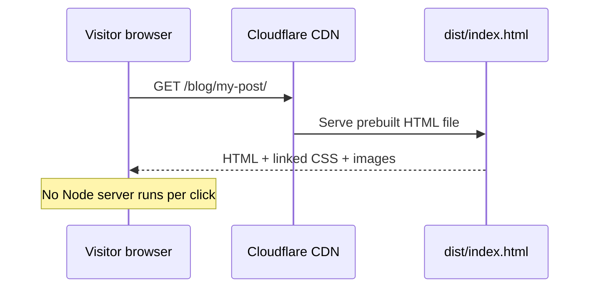

# 1. Introduction to Astro

[Astro](https://astro.build) is an open-source framework for building **websites**—especially marketing sites, blogs, documentation, and portfolios. It is not primarily a tool for building complex single-page applications (SPAs) like Gmail or Figma.

**Back to series:** [Astro basics index](./README.md)

---

## The core idea

Most websites are mostly **content**: headings, paragraphs, images, links. Visitors do not need a large JavaScript framework downloaded on every page just to read an article.

Astro’s default approach:

1. **Generate HTML at build time** (or on the server, if configured).
2. **Ship minimal JavaScript** to the browser.
3. **Add interactivity only where needed** via optional “islands” (React, Vue, Svelte, etc.).

The result is fast pages, simpler hosting, and HTML that works even when JavaScript fails or is disabled.

### What the browser actually downloads

On a typical Constellation page, the visitor gets:

- **HTML** — full article and layout, already rendered
- **CSS** — global Tailwind, legacy Divi extract, optional per-page rules in `<head>`
- **Images / fonts** — from `/images/`, `/fonts/` (static files)
- **Little or no Astro-authored JS** — no framework runtime hydrating the whole page

Third-party scripts (booking widget, YouTube, future GTM) are separate embeds, not Astro islands.

---

## What you write

| Artifact | Role |
|----------|------|
| **`.astro` files** | Pages and reusable UI components |
| **HTML** | Markup in the template section |
| **CSS** | Scoped styles in components, or global stylesheets |
| **JavaScript / TypeScript** | Runs in frontmatter at build time; optional client `<script>` |
| **Other frameworks** | Optional: embed React/Vue/Svelte only on interactive widgets |

You do **not** need React or Vue to use Astro. Many Astro sites are plain `.astro` + HTML + CSS.

---

## Astro is not a “language”

People sometimes say “Astro language,” but Astro is a **framework** built on:

- A **component file format** (`.astro`)
- A **build tool** (Vite under the hood)
- **Conventions** for routing, layouts, and data loading

The template section inside `.astro` files looks like **HTML with expressions** (similar to JSX). The frontmatter block is **JavaScript or TypeScript**.

---

## When Astro is a good fit

| Good fit | Poor fit |
|----------|----------|
| Marketing / brochure sites | Real-time collaborative apps |
| Blogs and docs | Heavy client-side dashboards |
| Landing pages and SEO content | Apps that need constant server state per user |
| Migrating static or CMS-exported HTML | Products where every screen is highly interactive |

Constellation’s public site is a **good fit**: hundreds of content pages, lead-gen CTAs, and third-party embeds (booking, forms)—not a logged-in product.

---

## How Astro compares (at a glance)

| | Astro | Next.js / Nuxt | Plain HTML |
|--|-------|----------------|------------|
| **Default output** | Static HTML | Often SSR or hybrid | Static files |
| **Components** | `.astro` + optional UI libs | Framework components | Copy-paste includes |
| **Build step** | Yes | Yes | Optional |
| **Learning curve** | Low if you know HTML | Higher | Lowest |
| **Interactivity** | Opt-in islands | Framework everywhere | Manual scripts |

Astro can use React-like patterns without shipping React to every page.

---

## Key terms (used in the rest of this series)

| Term | Meaning |
|------|---------|
| **Frontmatter** | Code between `---` at the top of a `.astro` file; runs at build time |
| **Component** | Any `.astro` file you import and use as a tag |
| **Page** | A `.astro` file under `src/pages/` that becomes a URL |
| **Layout** | A component that wraps other components (often with shared chrome) |
| **Slot** | A placeholder where child content is injected |
| **Island** | A client-hydrated UI widget (React/Vue/etc.) with directives like `client:load` |
| **SSG** | Static site generation—HTML built ahead of time |
| **SSR** | Server-side rendering—HTML built per request |
| **Vite** | Build tool Astro uses for dev server, bundling, and hot reload |
| **Prerender** | Generate static HTML for a route at build time (default in static mode) |

---

## Request flow (static site)

The `.astro` files you edit are **source code**. Visitors never download them—only the compiled HTML in `dist/`.

---

## What Constellation uses today

Our production-bound repo uses Astro in a **simple, HTML-first** way:

- `output: 'static'` — all pages pre-rendered at build time
- No React/Vue islands
- Content in `.astro` page files, not a headless CMS

Details: [ASTRO.md](../ASTRO.md).

---

## Next

[2. The `.astro` file →](./02-astro-file-syntax.md)
