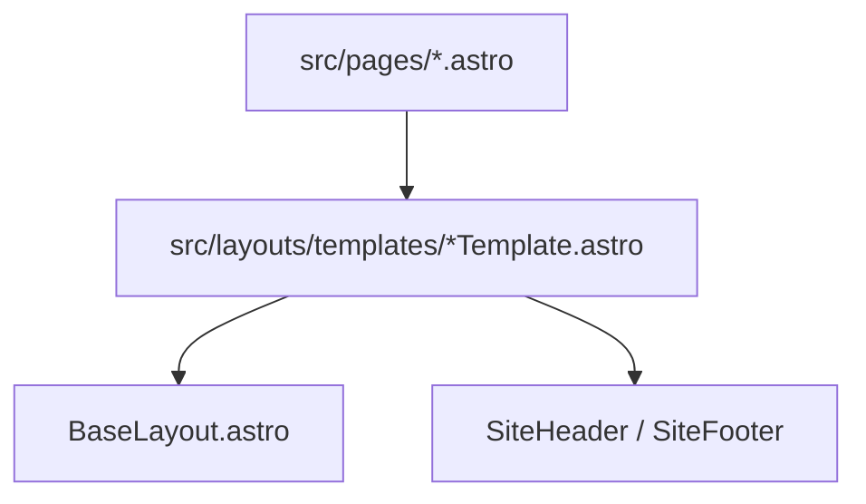

# 4. Slots and layouts

**Layouts** are a pattern, not a separate Astro file type: any component can wrap a page and expose **slots** for injected content.

**Back to series:** [Astro basics index](./README.md) · **Previous:** [Components and props](./03-components-and-props.md)

---

## Why layouts exist

Most pages share the same outer structure:

- `<html>`, `<head>`, meta tags
- Site header and footer
- One region that changes per page (article body, city copy, etc.)

Instead of copying header/footer into 400 files, you:

1. Put shared chrome in a **layout component**.
2. Put page-specific content in the **default slot**.

---

## Default slot

The **default slot** receives any child markup not assigned to a named slot.

**Layout:**

```astro
---
// BaseLayout.astro
const { title } = Astro.props;
---
<!DOCTYPE html>
<html lang="en">
  <head>
    <title>{title}</title>
  </head>
  <body>
    <slot />
  </body>
</html>
```

**Page:**

```astro
---
import BaseLayout from '../layouts/BaseLayout.astro';
---
<BaseLayout title="Contact">
  <main>
    <h1>Contact us</h1>
  </main>
</BaseLayout>
```

`<main>...</main>` replaces `<slot />` in the output HTML.

---

## Named slots

When a layout needs **multiple regions** (e.g. main content + extra `<head>` styles), use **named slots**.

**Layout:**

```astro
<head>
  <title>{title}</title>
  <slot name="head" />
</head>
<body>
  <slot />
</body>
```

**Page:**

```astro
<BaseLayout title="Blog post">
  <style slot="head">
    body { background: #efefef; }
  </style>
  <article>
    <p>Post body...</p>
  </article>
</BaseLayout>
```

| Slot attribute | Renders at |
|----------------|------------|
| (none) | Default `<slot />` |
| `slot="head"` | `<slot name="head" />` |

Constellation’s `BaseLayout` uses a named `head` slot for per-page CSS overrides without duplicating the full document shell.

### Fallback content inside a slot

A layout can render defaults when the parent omits content:

```astro
<slot name="sidebar">
  <aside>Default sidebar CTA</aside>
</slot>
```

If the page provides `<div slot="sidebar">...</div>`, the default is replaced entirely.

### Multiple children and one default slot

Everything not tagged with `slot="..."` goes to the **default** slot, in order:

```astro
<BlogPostTemplate seoTitle="...">
  <p>First paragraph</p>
  <h2>Section</h2>
  <p>More copy</p>
</BlogPostTemplate>
```

All of that markup appears together at `<slot />` inside the template’s article region.

---

## Checking if a slot is used

In frontmatter:

```astro
---
const hasHeadSlot = Astro.slots.has('head');
---
```

Useful for conditional wrapper markup; uncommon on simple marketing pages.

---

## Nested layouts (stacking)

Real sites often stack layouts:

```
Page (src/pages/blog/post.astro)
    → BlogPostTemplate (hero, sidebar, article shell)
        → BaseLayout (<html>, SEO meta, global CSS)
            → SiteHeader / SiteFooter (components)
```

Each level can add props and slots. The **page file stays thin**: SEO props + HTML body only.

Example mental model from our repo:



See [TEMPLATES.md](../TEMPLATES.md) for each template’s props.

---

## Layout vs page: who owns what?

| Concern | Usually in… |
|---------|-------------|
| URL-specific SEO title, canonical | Page file (passed as props) |
| Page-type chrome (blog hero, city map) | Template layout |
| Global `<head>`, fonts, site CSS | `BaseLayout` |
| Navigation links | `SiteHeader` component |

---

## Anti-patterns

| Avoid | Prefer |
|-------|--------|
| Duplicating `<html>` in every page | One `BaseLayout` |
| Huge layout with 50 optional props | Template per page **type** |
| Putting full article HTML in the layout | HTML in page file, layout wraps with `<slot />` |

---

## Slots vs props

| Use **props** when… | Use **slots** when… |
|---------------------|---------------------|
| Data is short (strings, numbers, arrays) | Content is rich HTML markup |
| You need typed fields in `interface Props` | Authors write paragraphs, headings, lists |
| Same structure, different values | Same wrapper, different body |

Blog posts on our site: `chapters={[...]}` as props; article HTML in the default slot.

### Real stack on this repo (concrete)

| Layer | File (example) | Responsibility |
|-------|----------------|----------------|
| Page | `src/pages/blog/law-firm-seo.astro` | `seoTitle`, `canonicalUrl`, `chapters`, article HTML in slot |
| Template | `src/layouts/templates/BlogPostTemplate.astro` | Hero, sidebar TOC, `.article-body` wrapper |
| Document | `src/layouts/BaseLayout.astro` | `<html>`, meta, OG tags, `global.css`, `head` slot |
| Chrome | `SiteHeader.astro`, `SiteFooter.astro` | Nav and footer |

Templates import `BaseLayout` and place header/footer around `<slot />`—pages never import `BaseLayout` directly on blog routes.

---

## Next

[5. Routing and pages →](./05-routing-and-pages.md)
