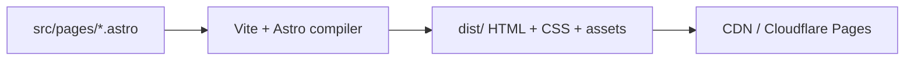

# 6. Build time vs runtime

Astro blurs the line between “build tool” and “framework” because the same `.astro` file runs code in **different environments** depending on which section you are in.

**Back to series:** [Astro basics index](./README.md) · **Previous:** [Routing and pages](./05-routing-and-pages.md)

---

## Two environments

| Environment | When it runs | Has access to |
|-------------|--------------|---------------|
| **Build time** (Node) | `npm run build` or `npm run dev` compile step | Filesystem, npm packages, env vars (server-side) |
| **Runtime** (browser) | Visitor loads the page | DOM, `window`, user events |

| Code location | Environment |
|---------------|-------------|
| Frontmatter `---` | Build time (or server per request in SSR mode) |
| Template | Build time → output HTML |
| `<style>` | Build time → CSS file or inline |
| `<script>` (no `is:inline`) | Browser (bundled client JS) |
| Framework island with `client:load` | Browser (hydrated component) |

---

## Static output (SSG) — what we use

```js
// astro.config.mjs
export default defineConfig({
  output: 'static',
});
```

| Behavior | Meaning |
|----------|---------|
| Every route pre-rendered | HTML files written to `dist/` |
| No Node server in production | CDN serves files only |
| Frontmatter runs at build | Not on each visitor request |
| `fetch` in frontmatter | Runs once during build |

**Commands:**

| Command | Purpose |
|---------|---------|
| `npm run dev` | Compiles on demand; hot reload |
| `npm run build` | Full static export to `dist/` |
| `npm run preview` | Serves `dist/` locally |

CI and Cloudflare use **`build`**, not `dev`. Always verify important changes with `build` + `preview`.

### Dev vs build vs preview

| | `npm run dev` | `npm run build` | `npm run preview` |
|--|---------------|-----------------|-------------------|
| **Speed** | Fast HMR while editing | Slower; full site compile | Serves existing `dist/` |
| **Output** | In memory / temp | Writes `dist/` | Reads `dist/` |
| **Matches production** | Close | Yes | Yes |
| **When to use** | Daily editing | Before PR / deploy | After build, catch prod-only bugs |

Changing **only** `public/` files sometimes shows up in `dev` without a full rebuild; changing **imports**, Tailwind, or `astro.config.mjs` always warrants `build` + `preview`.

### When you must rebuild

Content and markup changes in `.astro` files require a new build to reach production. There is no “publish button” on a CMS—merge to `main` triggers CI, which runs `npm run build` and deploys `dist/`.

---

## Server output (SSR) — not used here

```js
output: 'server'  // or 'hybrid'
```

| Behavior | Meaning |
|----------|---------|
| HTML can be generated per request | Needs a host that runs Node (or adapter) |
| Frontmatter can run on each visit | Good for personalized or always-fresh data |
| More operational complexity | Not “just upload `dist/`” |

Valid Astro mode; **Constellation’s repo does not use it** today.

---

## Hybrid mode (brief)

`output: 'hybrid'` lets most pages stay static while individual routes opt into SSR with:

```astro
---
export const prerender = false;
---
```

Useful for occasional dynamic pages without converting the whole site.

---

## Islands (client runtime)

An **island** is a UI component from React, Vue, Svelte, etc. that **hydrates** in the browser:

```astro
---
import Counter from '../components/Counter.jsx';
---
<Counter client:load />
```

| Directive | When JS loads |
|-----------|----------------|
| `client:load` | Immediately on page load |
| `client:idle` | When browser is idle |
| `client:visible` | When component enters viewport |

Islands are **optional**. Our site ships **no** `client:*` directives—pages are pure HTML plus third-party embeds.

---

## Mental model for debugging

Ask: **“Did this code run at build time or in the browser?”**

| Symptom | Likely layer |
|---------|----------------|
| `window is not defined` during build | Client API used in frontmatter |
| Data stale on live site | Static build; need rebuild or SSR |
| Works in `dev`, fails in `preview` | Run `npm run build`; check production bundling |
| Interactive widget dead | Client script, island, or third-party embed—not Astro template |

---

## Environment variables

| Prefix | Available in |
|--------|----------------|
| `import.meta.env.*` (public) | Frontmatter and client if prefixed for exposure |
| Secrets without public prefix | Build-time frontmatter only (do not expose to client) |

Never put API keys in client `<script>` or in HTML comments.

In Astro, only variables prefixed with `PUBLIC_` are exposed to the browser via `import.meta.env.PUBLIC_*`. Everything else is build-time only. See [ENVIRONMENT-AND-SECRETS.md](../ENVIRONMENT-AND-SECRETS.md) for this repo.

### `import.meta.env` (common flags)

| Variable | Meaning |
|----------|---------|
| `import.meta.env.DEV` | `true` during `astro dev` |
| `import.meta.env.PROD` | `true` during `astro build` |
| `import.meta.env.BASE_URL` | Base path if site is hosted in a subdirectory |

Rarely needed on our root-domain marketing site, but useful for conditional debug markup in templates.

---

## Build pipeline (simplified)



No database, no PHP, no per-request app server in our static setup.

---

## Next

[7. Template expressions →](./07-template-expressions.md) · [8. Assets, images, and styles →](./08-assets-images-and-styles.md)
