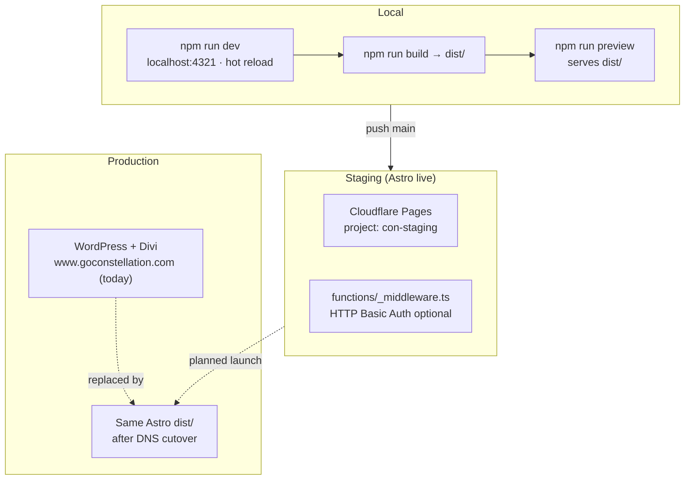
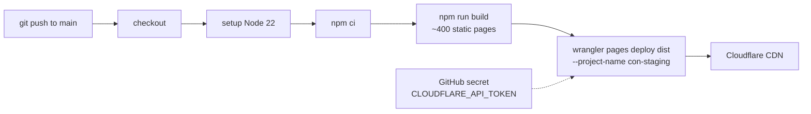
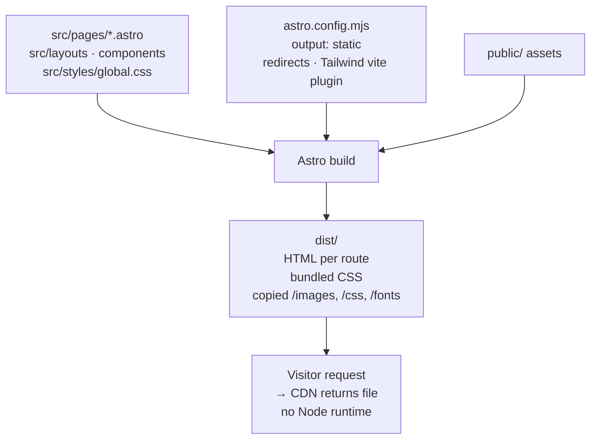
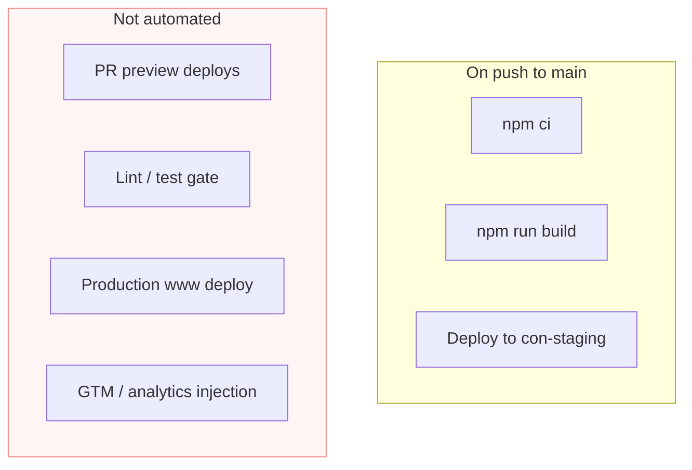
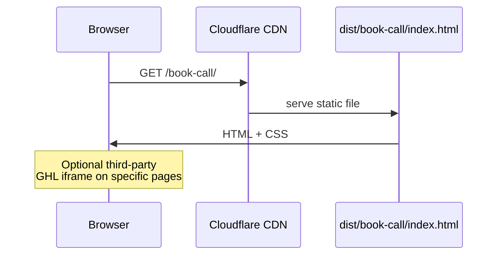

# Build and Deploy

From local development to Cloudflare CDN.

## Environments

```mermaid
flowchart TB
    subgraph LOCAL["Local"]
        DEV["npm run dev<br/>localhost:4321 · hot reload"]
        BUILD["npm run build → dist/"]
        PREVIEW["npm run preview<br/>serves dist/"]
        DEV --> BUILD --> PREVIEW
    end

    subgraph STAGING["Staging (Astro live)"]
        CF["Cloudflare Pages<br/>project: con-staging"]
        AUTH["functions/_middleware.ts<br/>HTTP Basic Auth optional"]
    end

    subgraph PROD["Production"]
        WP["WordPress + Divi<br/>www.goconstellation.com (today)"]
        ASTRO["Same Astro dist/<br/>after DNS cutover"]
    end

    LOCAL -->|"push main"| STAGING
    STAGING -.->|"planned launch"| ASTRO
    WP -.->|"replaced by"| ASTRO
```

## CI/CD pipeline

```mermaid
flowchart LR
    PUSH["git push to main"]
    CHECKOUT["checkout"]
    NODE["setup Node 22"]
    CI["npm ci"]
    BUILD["npm run build<br/>~400 static pages"]
    WRANGLER["wrangler pages deploy dist<br/>--project-name con-staging"]
    CDN["Cloudflare CDN"]

    PUSH --> CHECKOUT --> NODE --> CI --> BUILD --> WRANGLER --> CDN

    SECRET["GitHub secret<br/>CLOUDFLARE_API_TOKEN"] -.-> WRANGLER
```

## Static build output

```mermaid
flowchart TB
    INPUT["src/pages/*.astro<br/>src/layouts · components<br/>src/styles/global.css"]
    CONFIG["astro.config.mjs<br/>output: static<br/>redirects · Tailwind vite plugin"]
    PUBLIC["public/ assets"]

    INPUT --> ASTRO["Astro build"]
    CONFIG --> ASTRO
    PUBLIC --> ASTRO
    ASTRO --> DIST["dist/<br/>HTML per route<br/>bundled CSS<br/>copied /images, /css, /fonts"]

    DIST --> VISITOR["Visitor request<br/>→ CDN returns file<br/>no Node runtime"]
```

## What CI does not do

```mermaid
flowchart TB
    subgraph YES["On push to main"]
        A["npm ci"]
        B["npm run build"]
        C["Deploy to con-staging"]
    end

    subgraph NO["Not automated"]
        D["PR preview deploys"]
        E["Lint / test gate"]
        F["Production www deploy"]
        G["GTM / analytics injection"]
    end

    style NO fill:#fff5f5,stroke:#e88
```

## Visitor request path (post-deploy)

```mermaid
sequenceDiagram
    participant User as Browser
    participant CF as Cloudflare CDN
    participant HTML as dist/book-call/index.html

    User->>CF: GET /book-call/
    CF->>HTML: serve static file
    HTML->>User: HTML + CSS
    Note over User: Optional third-party<br/>GHL iframe on specific pages
```
