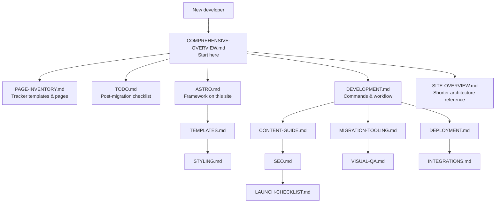
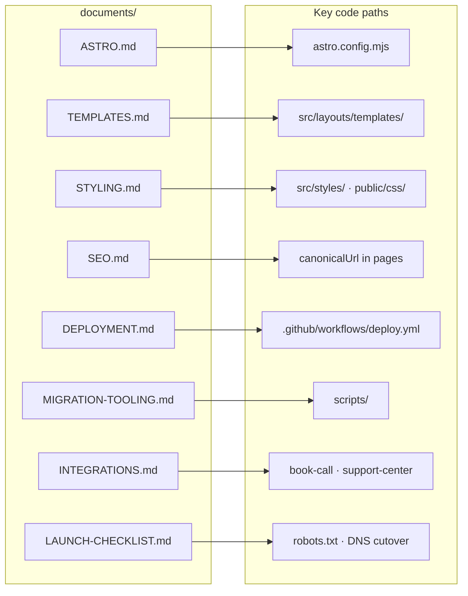
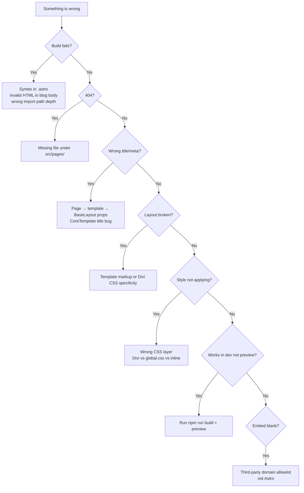
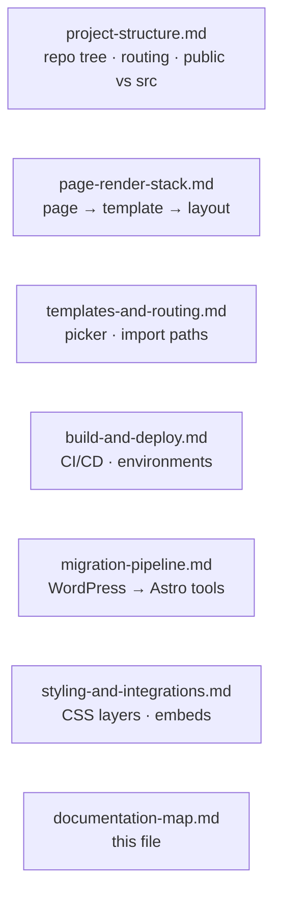

# Documentation Map

How the internal docs relate to each other and to the codebase.

## Recommended reading order

## Doc topics → codebase areas

## Debugging decision tree

## Graphs in this folder

