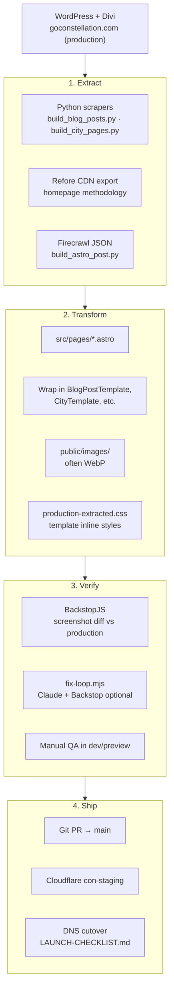
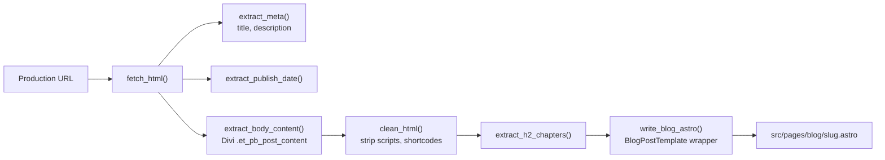
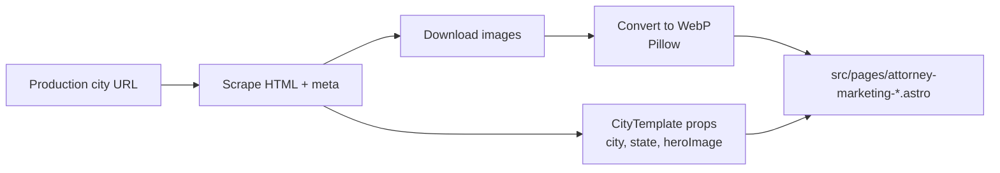
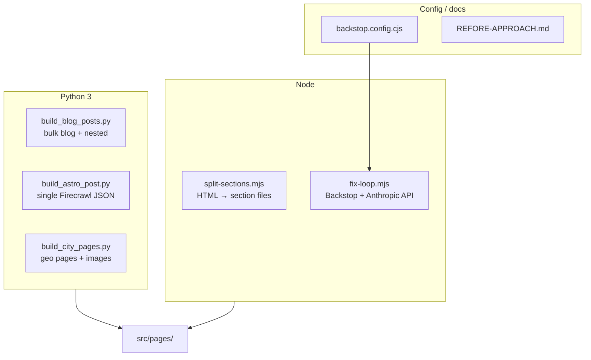
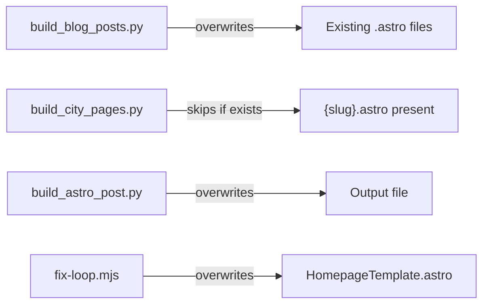
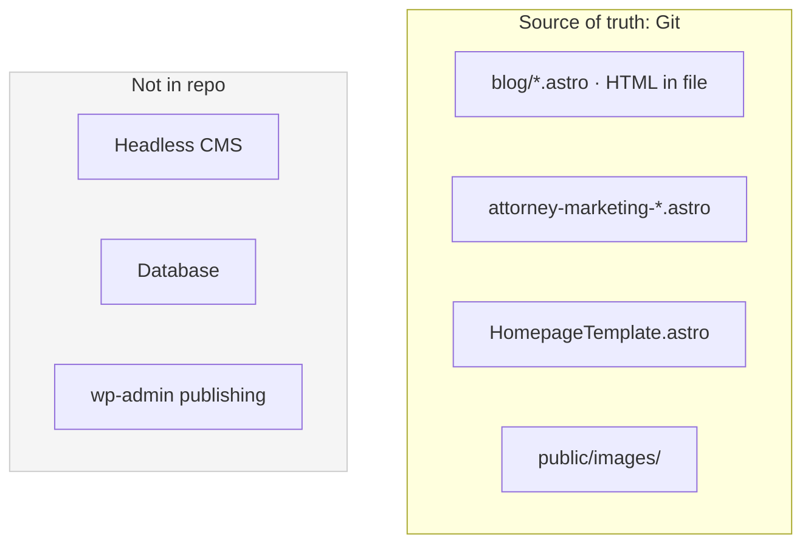

# Migration Pipeline

WordPress/Divi to Astro: extract, transform, verify.

## End-to-end migration

## Blog post scraper pipeline

## City page scraper pipeline

## Tool map

## Script overwrite behavior

## Content sources after migration

