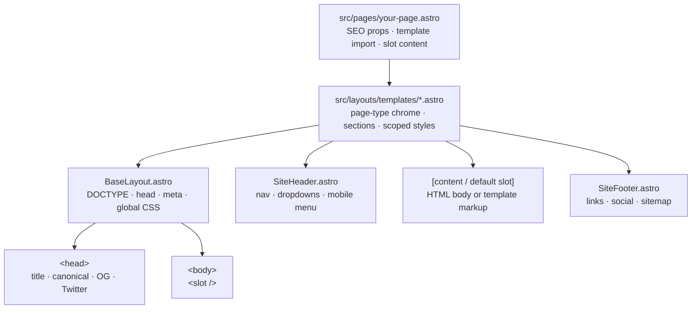
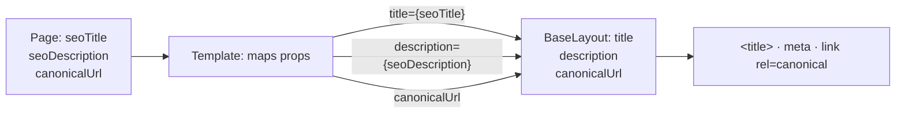
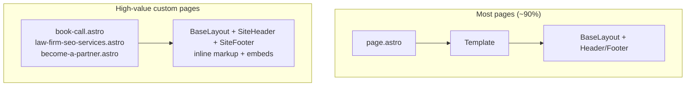
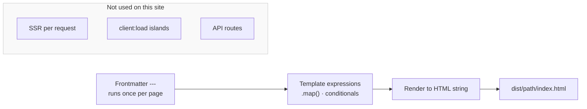

# Page Render Stack

How a visitor-facing page is assembled at build time.

## Default page composition



## SEO prop flow



## Blog post with slot content

```mermaid
sequenceDiagram
    participant Page as blog/post.astro
    participant Blog as BlogPostTemplate
    participant Base as BaseLayout
    participant Browser as dist HTML

    Page->>Blog: seoTitle, chapters, publishDate
    Page->>Blog: default slot (article HTML)
    Blog->>Base: title, description, canonicalUrl
    Blog->>Blog: render hero, TOC, article-body
  Note over Blog: &lt;style is:global slot="head"&gt;
    Blog->>Browser: static HTML at build time
```

## Hand-built pages (no template)



## Astro build-time execution


