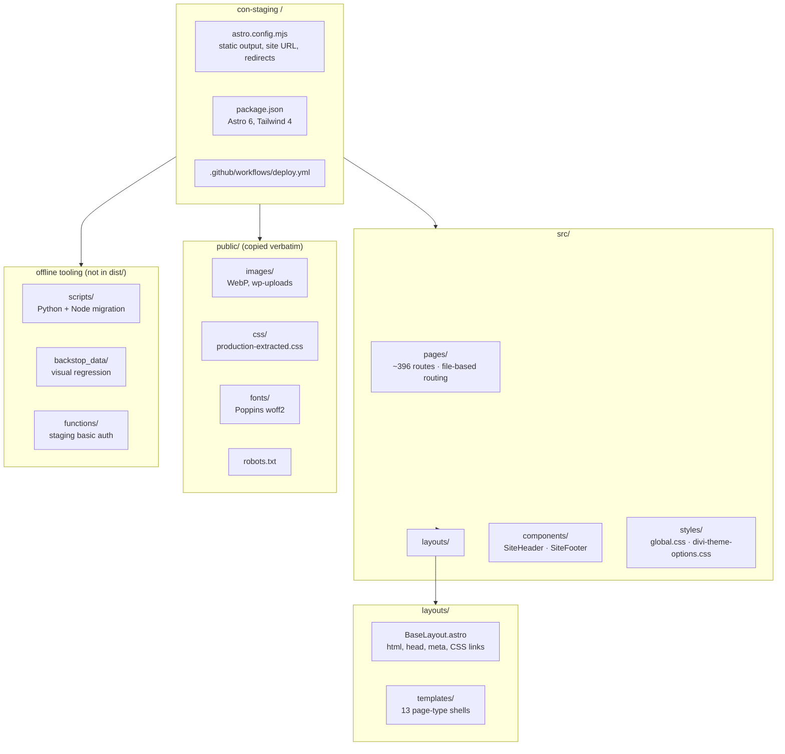
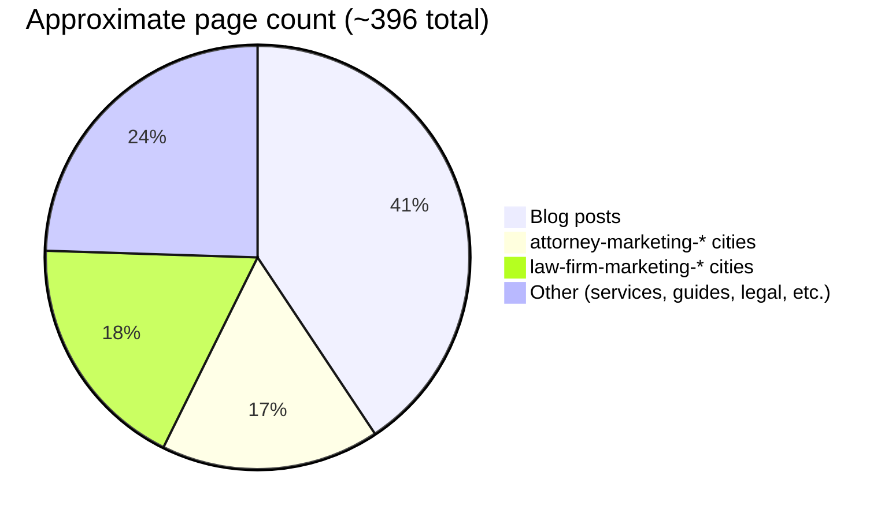
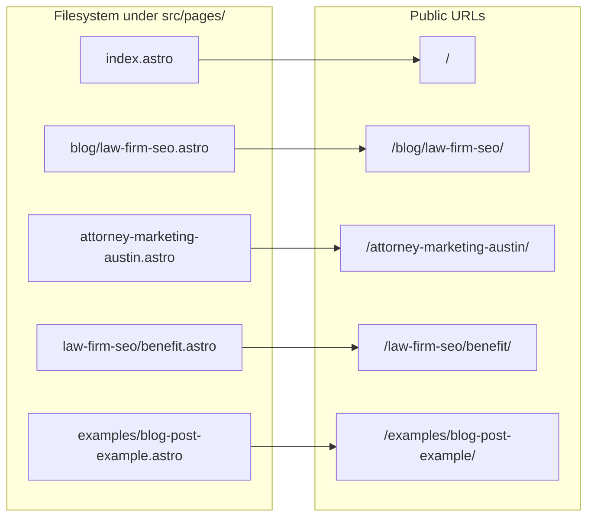
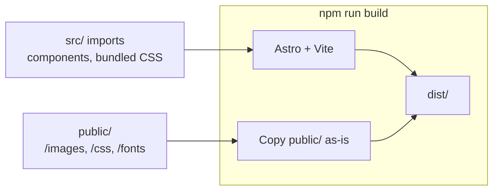

# Project Structure

Repository layout for the Constellation Marketing Astro site (`con-staging`).

## Repository tree

## Page scale by route family

## src/pages routing model

## public/ vs src/ processing

