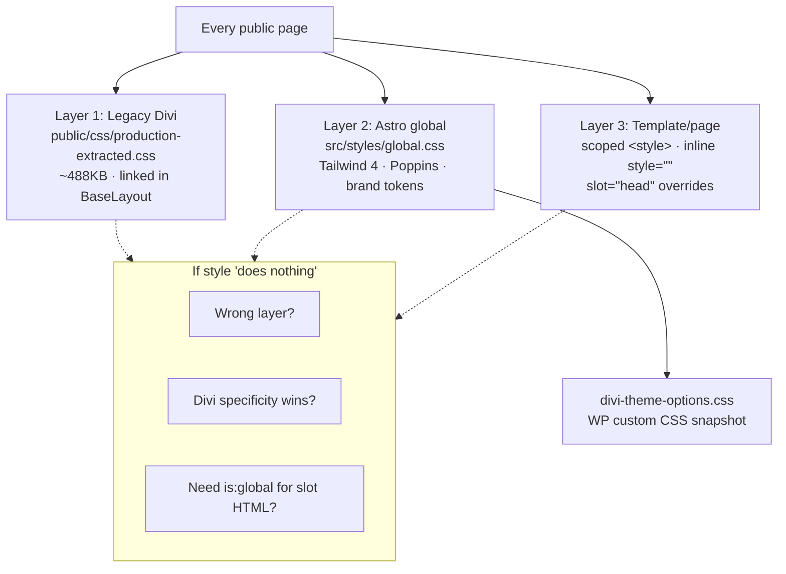
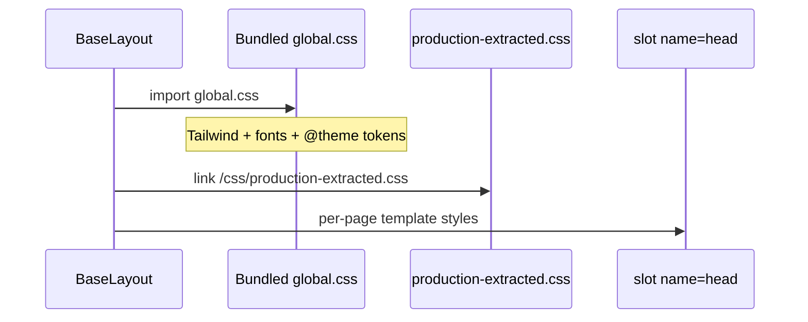
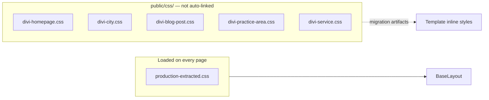
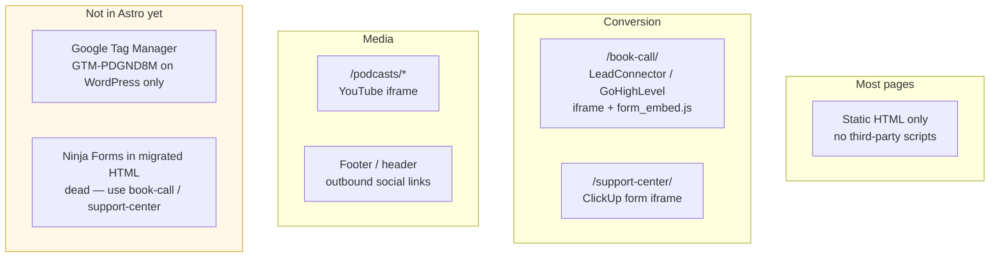
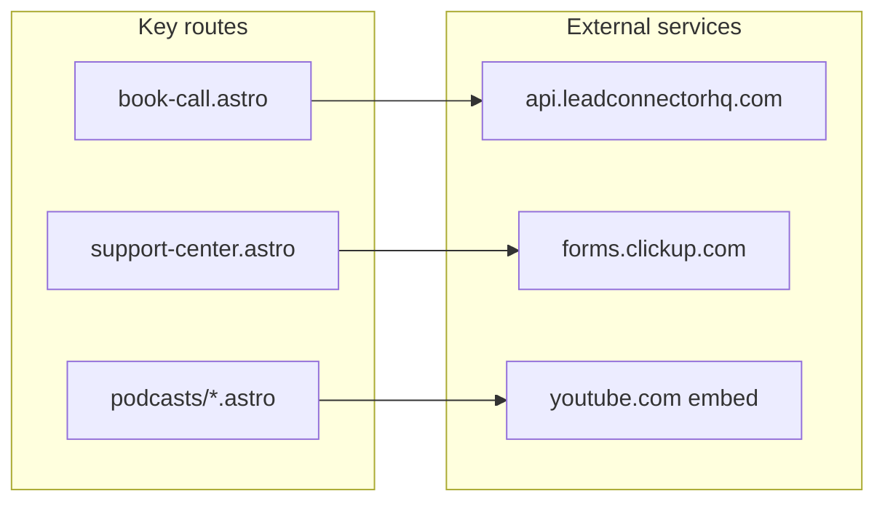
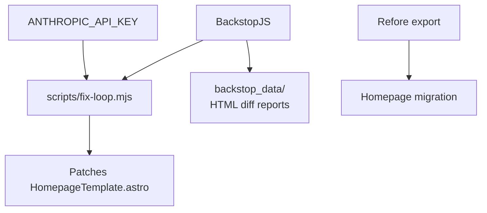

# Styling and Integrations

CSS layers and third-party services.

## Three CSS layers (every page)

## CSS load order in BaseLayout

## Page-specific Divi CSS (reference only)

## Visitor-facing integrations

## Integration matrix

## Dev-only tooling (not visitor-facing)

