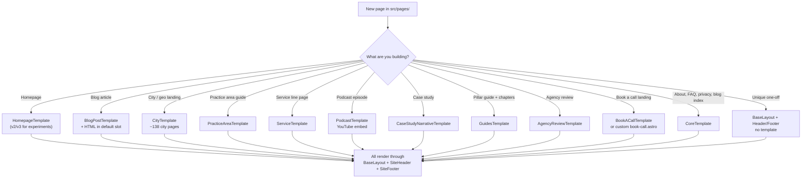
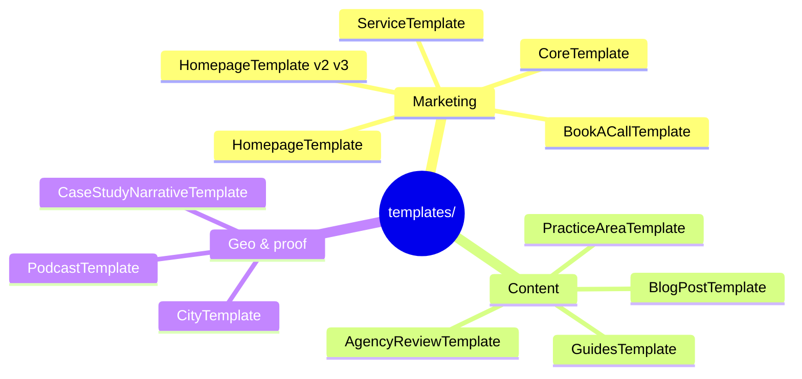
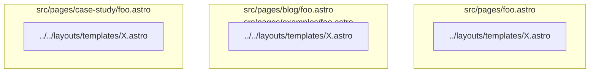
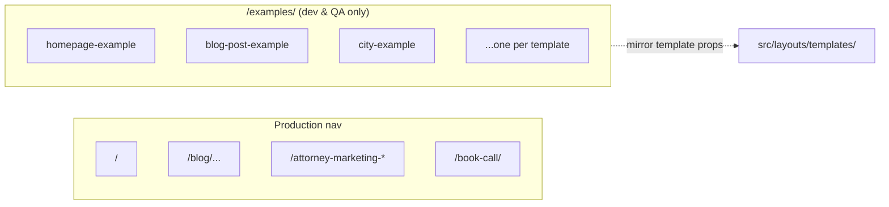
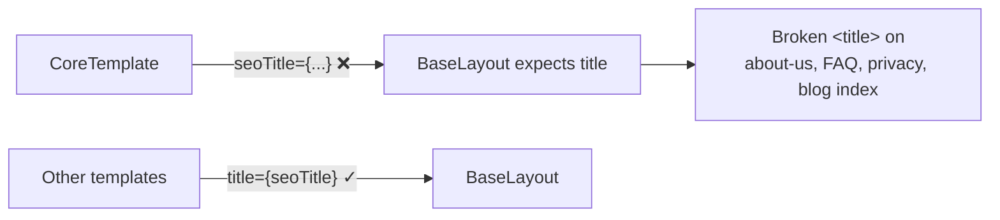

# Templates and Routing

Template picker and relationships between page types.

## Template picker (decision flow)

## Template catalog

## Import path depth

## Example routes for QA

## Known template → BaseLayout bug

